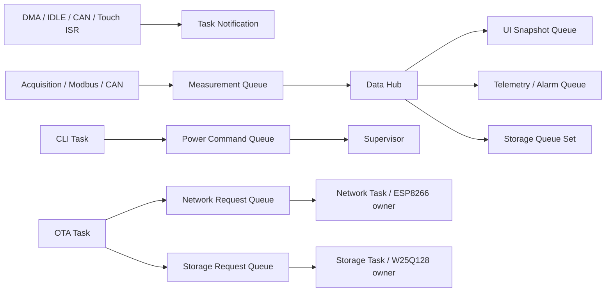

# 架构审计与项目交付报告

审计日期：2026-08-15

## 1. 交付结论

工程达到 **Host Verified + ARM Build Verified**：业务逻辑、协议状态机、对象
生命周期和错误路径由 Host 测试覆盖；Bootloader、App A、App B 均通过 Arm GCC
Debug/Release 构建及 ELF/分区门禁。未执行真实开发板测试，因此所有电气、时序、
功耗、外设 ID、复位和 A/B 回滚结果保持 **Board Unverified**。

## 2. 架构边界审计

| 边界 | 审计结果 | 证据 |
|---|---|---|
| Application 与 HAL 隔离 | 通过 | `firmware/app` 无 `HAL_*`、GPIO/RCC 寄存器直接访问 |
| 设备面向对象接口 | 通过 | I2C/SPI、传感器、LCD、触摸、Flash、ESP8266、Watchdog 均使用实例结构体与常量 Ops |
| 子系统封装 | 通过 | Acquisition、Fieldbus、Alarm、Storage、Network、OTA、UI、Reliability 通过 Facade 暴露业务 API |
| 外设单一所有者 | 通过 | Network Task 独占 ESP8266；Storage Task 独占 W25Q128；UI Task 独占 LVGL |
| 低功耗控制器所有权 | 已修正 | CLI 只投递 `q_power_command`，Supervisor 是唯一状态修改者 |
| 静态内存策略 | 通过 | 十任务、十五条 Queue、Queue Set、Event Group、Mutex 和任务栈均静态分配；手写 App 无 malloc/free |
| ISR 边界 | 通过 | UART/CAN/GT911 ISR 只搬运最少数据或发送 Task Notification，协议解析在任务上下文 |
| Bootloader 独立性 | 通过 | Bootloader 不链接 FreeRTOS/LVGL，App A/B 与 Metadata/descriptor 分区独立门禁 |

## 3. RTOS 数据与控制闭环

每条业务 Queue 均有真实生产者和消费者。Queue Set 仅用于 Storage 多消息类型
等待；Event Group 用于启动状态、故障状态和六任务低功耗静默屏障；Mutex 用于
Snapshot/Config 事务；Task Notification 用于 ISR 唤醒及 OTA 请求完成回执。

## 4. 本轮修正

1. 新增静态 Power Command Queue，消除 CLI 与 Supervisor 对
   `deep_power_controller_t` 的多写者关系，并纳入 Registry 与高水位诊断。
2. Storage/Deep Power 诊断改为短临界区快照，避免用不对称 Mutex 表达错误的
   共享保护关系。
3. ESP8266 `resume` 调用串口 Ops 的 `resume`，恢复后再执行 AT 初始化序列；网络
   Suspend 在可用时先发送 MQTT DISCONNECT，并保留 QoS 1 DUP 恢复语义。
4. CMake、VS Code 和 CubeMX 工具移除个人绝对路径，改为 `PATH` 或环境变量发现。
5. 增加许可证、第三方声明、安全边界、Git 属性和 GitHub Host CI。

## 5. 发布门禁

- Host：11 个 CTest 必须全部通过。
- ARM Debug/Release：Bootloader、App A、App B 必须全部构建成功。
- ELF：向量地址、Flash/RAM 边界、Bootloader 禁止符号和 App 必需符号必须通过。
- OTA：package header、目标型号、Slot、image size、CRC32、SHA-256 与 Manifest 一致。
- 仓库：不包含 `build/`、凭据、私钥、个人绝对路径或单文件超过 GitHub 100 MB 限制。

最终记录：Host C/Python `11/11`；Debug App A/B 为 228,176 B Flash、
102,648 B RAM；Release App A/B 分别为 201,244/201,252 B Flash、102,648 B
RAM；最新 Slot B package 为 201,400 B，SHA-256 为
`a1ad2bd5cc73caef922e30f29e81b331ca696250595055795431abda87e1ad83`。

## 6. 上板前不得宣称完成的项目

- LCD/GT911 ID、FSMC 时序、触摸方向、外部 SRAM 和背光极性。
- ADS1115/MAX31865/SHT30、RS485、CAN、继电器和 W25Q128 的真实波形与长期运行。
- IWDG 复位、HardFault 跨复位归档、掉电一致性、A/B trial/boot-ok/rollback。
- ESP8266 AP/Broker 故障恢复、HTTP 下载、STOP/Standby 唤醒和整板功耗。

这些项目已有逐项验收文档，但在获得示波器、逻辑分析仪、功耗仪和真实开发板证据
前统一保持未验证状态。
