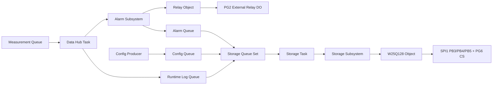

# Alarm、Relay 与 W25Q128 板级说明

## 验证状态

本说明记录已进入源码、Host 测试和 ARM 构建门禁的控制与存储实现。当前状态为 **Host Verified + ARM Build Verified / Board Unverified**，尚未连接 ST-LINK、继电器模块或在板载 W25Q128 上执行擦写与掉电实验。

## 业务闭环

Data Hub 先更新告警状态，再发布持久化请求。Storage Task 是 Application 中 W25Q128 的单一业务所有者；Queue Set 只负责多类型队列等待，不替代各队列自己的容量和满载策略。

## 引脚基线

| 功能 | MCU 引脚 | 配置 | 当前用途 |
|---|---|---|---|
| SPI1 SCK | PB3 | AF5，Mode 3 | 板载 W25Q128 时钟 |
| SPI1 MISO | PB4 | AF5 | W25Q128 数据输出 |
| SPI1 MOSI | PB5 | AF5 | W25Q128 数据输入 |
| W25Q128 CS | PG6 | GPIO Output，默认高 | 低有效片选 |
| Relay DO | PG2 | GPIO Push-Pull，Pull-down，默认低 | 外接 active-high 继电器模块控制 |

PG2 在这里定义为外部扩展信号，不代表开发板自带继电器。上板前必须按手中开发板的准确版本原理图确认 PG2 的排针位置、复用功能和上电电平。

## 继电器电气约束

- PG2 只输出 3.3 V 逻辑，不能直接驱动继电器线圈。
- 使用带三极管或 MOSFET、续流二极管的低压继电器模块；若模块带光耦，按模块手册确认是否需要共地以及高低电平触发方式。
- 当前软件配置为 active-high、默认去激励。CubeMX 在 GPIO 初始化前先写低电平，Relay 对象启动后再次写入配置安全态。
- 本阶段只允许切换安全低压演示负载，不直接切换市电，也不宣称满足工业安全完整性或隔离认证。
- 数据质量异常会立即调用 `relay_force_safe()`；越限告警则经过连续样本确认，恢复需要达到滞回边界并满足连续恢复样本数。

## W25Q128 共享分区

| 区域 | 起始地址 | 大小 | 所有者与语义 |
|---|---:|---:|---|
| OTA staging | `0x000000` | 2 MB | Bootloader/Application OTA，原语义不变 |
| OTA metadata | `0x200000` | 4 KB | OTA 外部元数据保留区 |
| Config A | `0x201000` | 4 KB | Runtime 配置副本 A |
| Config B | `0x202000` | 4 KB | Runtime 配置副本 B |
| Crash | `0x203000` | 52 KB | 预留故障上下文区 |
| Alarm log | `0x210000` | 1 MB | 告警进入、恢复和确认记录 |
| Runtime log | `0x310000` | 4 MB | 测点运行日志 |
| Reserved | `0x710000` | 8.9375 MB | 后续功能保留 |

Application 与 Bootloader 都包含 `external_flash_layout.h`，OTA staging 和 metadata 的地址没有被告警/日志功能移动。Storage 记录固定为 128 B；每个 4 KB 扇区用第一个记录保存区域 ID 和 generation，剩余 31 个槽保存业务记录。配置采用独立 256 B wire format、CRC32 和 A/B generation 选择。

## 低功耗边界

`w25q128_power_down()` 与 `w25q128_wake()` 已实现并通过 Host Fake 验证，Storage/Metadata 写路径也已接入 `PM_LOCK_FLASH_WRITE`。Storage Task 现在会在 Eco、Queue Set 连续空闲 5 s 且无 OTA 活动时自动进入 Deep Power-down，并在取出下一条请求前先唤醒；真实器件唤醒时序、SPI 波形和节电幅度仍需板端确认。

Relay 的安全状态优先于低功耗。休眠或恢复流程不得为了降低线圈功耗改变安全语义，恢复后也必须通过 Relay 对象重新提交安全状态。

## 板端验收清单

- [ ] 核对手中开发板版本及 PG2、PG6、PB3、PB4、PB5 的原理图和排针位置。
- [ ] 上电不启动 Scheduler 时确认 PG2 保持低电平，继电器不误动作。
- [ ] 读取 W25Q128 JEDEC ID，预期软件配置为 `0xEF4018`，记录实际返回值。
- [ ] 用逻辑分析仪确认 SPI1 Mode 3、CS 边界、分页写和 Ready 轮询。
- [ ] 验证高限连续 3 个样本后吸合、滞回恢复连续 3 个样本后释放。
- [ ] 注入通信质量故障，确认 Relay 立即进入配置安全态且告警记录可回读。
- [ ] 在日志写入、配置 A/B 提交和扇区轮转阶段执行受控掉电，确认重启挂载与回退结果。
- [ ] 确认 OTA staging 下载和安装不覆盖 Config、Alarm Log 或 Runtime Log。
- [ ] 完成以上证据前保持 Board Unverified。

## 参考资料

- [野火 STM32F407 霸天虎开发板资料入口](https://doc.embedfire.com/stm32_products/must_read/zh/latest/doc/introduction_of_stm32/STM32/ebf_stm32f407_batianhu_v1_v2/stm32f407_batianhu_v1_v2.html)：用于下载与手中板型一致的原理图并核对扩展引脚。
