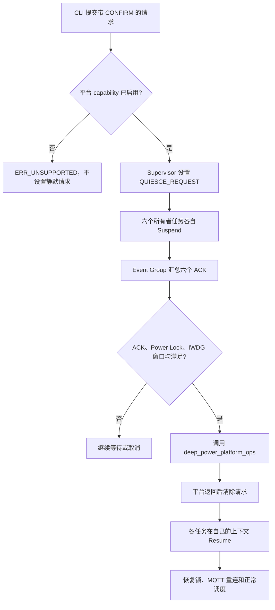

# STM32F407 深度低功耗软件闭环与验收边界

## 当前结论

本阶段达到 **Host Verified + ARM Build Verified**，不是 **Board Verified**。

- 已接线：ESP8266 在线 Modem-sleep、W25Q128 Eco 空闲自动 Deep Power-down/按需 Wake、Tickless 门禁与唤醒分类、六任务静默屏障、深睡确认与回退、应用临界区 DWT 统计。
- 默认禁用：F407 STOP Periodic 与 Standby Shipping 的真实平台入口。
- 尚未证明：RTC/EXTI 唤醒、FreeRTOS 深睡时间补偿、PLL/时钟树恢复、UART/CAN/FSMC/SRAM/W25Q128 恢复和整板功耗。

## 对象和所有权

| 对象 | 所有者 | 职责 |
|---|---|---|
| `power_manager_t` | Supervisor Task | Active/Eco、引用计数 Power Lock、Tickless 和 IWDG 门禁 |
| `deep_power_controller_t` | Supervisor Task | 显式请求、确认令牌、ACK/Lock/IWDG 检查和平台 Ops 调用 |
| `storage_subsystem_t` | Storage Task | W25Q128 空闲休眠、请求到达后的唤醒及统计 |
| `network_subsystem_t` | Network Task | MQTT Suspend/Resume、Transport 重建和 QoS 1 DUP 恢复 |
| `critical_timing_monitor_t` | 应用临界区包装 | DWT 周期、嵌套深度和配对错误统计 |

Deep Power Controller 不直接调用设备，也不绕过 Task 所有权。各任务只暂停和恢复自己拥有的对象，Event Group 只传递静默状态，不携带业务负载。

## Eco 外设闭环

### W25Q128

Storage Task 每次等待 Storage Queue Set 最多 1 s。满足以下条件连续 5 s 后，调用 `storage_subsystem_power_down()`：

1. Power Manager 当前为 Eco。
2. 没有日志、告警、配置或 OTA storage 请求。
3. 没有 OTA 活动。
4. Flash 已挂载且尚未休眠。
5. 能短时取得 `PM_LOCK_FLASH_WRITE`，避免休眠命令和 Tickless 竞争。

任意 Queue Set 成员到达时，Storage Task 先执行 `storage_subsystem_wake()`；唤醒成功后才从 Queue 取出请求。这样唤醒失败不会丢失队列消息。Power-down/Wake 均为幂等操作，并记录次数、当前状态和失败次数。

### ESP8266

ESP8266 初始化和断线重连后发送 `AT+SLEEP=2`，保持 Wi-Fi 在线 Modem-sleep。深睡静默时 Network Task 调用 `network_subsystem_suspend()` 关闭 TCP 和 UART；恢复时重建 Transport，进入 Offline 状态并按既有重连状态机恢复 MQTT。在途 QoS 1 消息保留 Packet ID，并设置 DUP。

## STOP/Standby 静默流程



静默参与者为 Acquisition、Modbus、CAN、Network、Storage、UI。Data Hub 在 Acquisition 停止后只排空已有测点；OTA 通过 `PM_LOCK_OTA` 阻止深睡；CLI 保留为控制入口；活动告警通过 `PM_LOCK_ALARM_ACTIVE` 阻止深睡且不改变 Relay 安全状态。

CAN Task 在 Suspend 成功后释放长期 `PM_LOCK_CAN_MONITORING`，Resume 成功后重新获取。其他短事务 Lock 必须自然释放，Controller 不替任务清锁。

## 为什么默认关闭真实深睡

`F407_STOP_PERIODIC_ENABLED` 和 `F407_STANDBY_SHIPPING_ENABLED` 当前均为 `0`。F407 平台 Ops 明确返回 `ERR_UNSUPPORTED`，不会用一个裸 `WFI` 冒充 STOP 闭环。

真实启用前至少需要确定：

1. RTC 时钟源和周期唤醒精度，或明确的 EXTI 唤醒引脚。
2. STOP 期间 IWDG 是否继续运行以及允许的最长窗口。
3. 唤醒后 HSE、PLL、AHB/APB 和 SysTick 的恢复顺序。
4. FreeRTOS tick 补偿依据，不能把计划时长当作实际睡眠时长。
5. USART1/2/3、CAN、SPI、FSMC、外部 SRAM、LCD、GT911 和 W25Q128 的恢复结果。
6. Standby 是复位语义，必须保存必要状态并从 Bootloader 正常重启。

## CLI

```text
power status
power stats
power lock
power stop 5000 CONFIRM
power standby CONFIRM
power cancel
storage status
```

当前目标板配置下，`power stop` 和 `power standby` 必须返回 `ERR_UNSUPPORTED`。`power status` 显示 capability、pending、Deep Power 状态和六任务 ACK；`power stats` 显示请求/等待/进入/恢复/失败以及应用临界区统计；`storage status` 显示 W25 休眠、唤醒和失败次数。

## 验证证据

- Host CTest：11/11 PASS。
- Deep Power Mock：确认令牌、能力关闭、ACK 不全、Lock 阻止、IWDG 窗口、STOP 返回、Standby 异常返回和失败清理。
- Storage Mock：重复 Power-down/Wake 不重复计数，状态和失败统计可读。
- Network Mock：Suspend 后禁止状态机偷偷重连，Resume 后恢复 MQTT Ready。
- Critical Timing Mock：嵌套、配对错误、最长周期和 32 位计数回绕。
- ARM Debug/Release：App A/B 均通过 deep-power barrier 制品符号和源码路由门禁。

## 板端启用顺序

1. 先保持 capability 为 0，验证 Active/Eco/Tickless、W25 自动休眠和 ESP8266 Modem-sleep。
2. 使用 GPIO/逻辑分析仪确认六任务 ACK 和恢复顺序，不进入 STOP。
3. 只启用 STOP，限定一种 RTC/EXTI 唤醒源和较短时长，逐项验证时钟与外设恢复。
4. 完成一小时采集、MQTT、CAN/Modbus、IWDG 和 OTA 回归后，才允许扩大 STOP 窗口。
5. Standby 最后单独验证，并按“复位后重新启动”而不是函数返回来验收。

未完成上述证据前，项目状态保持 **Board Unverified**。
