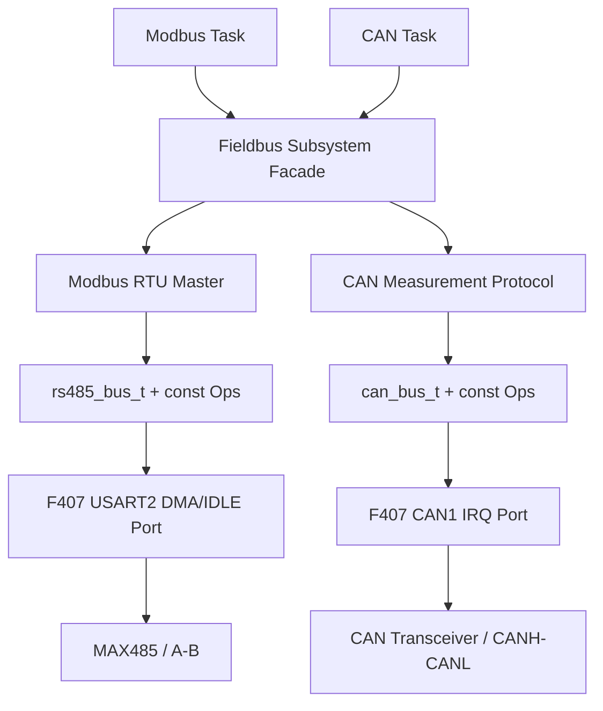
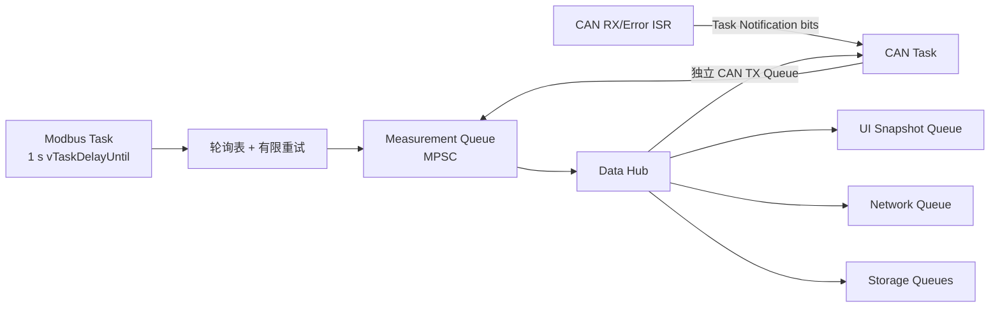

# F407 RS485 Modbus 与 CAN 接线及验证

## 验证状态

本文记录已经进入源码、Host 测试和 ARM 构建门禁的现场总线实现。当前状态为 **Host Verified + ARM Build Verified / Board Unverified**，没有连接真实 Modbus 从站或 CAN 节点，不把编译通过等同于实机通信通过。

## 板级引脚与跳帽

| 总线信号 | STM32F407 引脚 | 开发板连接 | 当前源码用途 |
|---|---|---|---|
| RS485 TX | PA2 / USART2_TX | 跳帽连接 `PA2 <-> 485_D` | Modbus 请求 DMA 发送 |
| RS485 RX | PA3 / USART2_RX | 跳帽连接 `PA3 <-> 485_R` | Receive-to-IDLE DMA 响应接收 |
| RS485 DE/RE | PC0 | 板载 MAX485 方向控制 | 高电平发送，低电平接收 |
| RS485 A/B | 板载接线端子 | A 对 A、B 对 B | 半双工差分总线 |
| CAN1 RX | PB8 / CAN1_RX | 板载 CAN 收发器 | FIFO0 中断接收 |
| CAN1 TX | PB9 / CAN1_TX | 板载 CAN 收发器 | 标准数据帧发送 |
| CANH/CANL | 板载接线端子 | CANH 对 CANH、CANL 对 CANL | 高速 CAN 差分总线 |

RS485 和 CAN 收发器默认不供电。使用对应板载收发器前，均需把其接线端子旁的 `C/4-5V` 与 `5V` 通过跳帽连接。RS485 还必须连接 `PA2 <-> 485_D`、`PA3 <-> 485_R`；PC0 与摄像头信号复用，CAN 信号也与摄像头接口共享，因此现场总线验证期间不要安装或驱动摄像头。

板载 RS485 A/B 和 CANH/CANL 端子均带 120 ohm 端接。两块开发板作为总线两端时可以使用板载端接；接入已有总线并作为中间节点时，必须根据实际拓扑核对端接，不能无条件再并入 120 ohm。

## CubeMX 基线与运行映射

CubeMX `.ioc` 为 CAN1 生成 PA11/PA12 基线，原因是当前命令行生成器无法稳定保存项目需要的组合。`f407_fieldbus_port.c` 在 `MX_CAN1_Init()` 后释放 PA11/PA12，再把 CAN1 AF9 重映射到板载收发器实际连接的 PB8/PB9。该步骤由 ARM 构建门禁检查。

USART2 的 PA2/PA3、DMA1 Stream5 RX、DMA1 Stream6 TX 和 PC0 DE 直接由 CubeMX 生成，板级端口只实现传输状态机、方向切换、DMA/IDLE 回调和 RTOS 通知。

CAN1 使用 APB1 42 MHz 时钟，当前位时序为：

```text
Prescaler = 12
Sync_Seg  = 1 Tq
BS1       = 11 Tq
BS2       = 2 Tq

bitrate = 42 MHz / (12 * (1 + 11 + 2)) = 250 kbit/s
sample point = (1 + 11) / 14 = 85.7%
```

真实节点必须配置相同的波特率。采样点、SJW 和线缆长度仍需结合总线拓扑及波形验证。

## 面向对象分层



对应源码：

- `firmware/app/devices/include/rs485_bus.h`
- `firmware/app/devices/include/can_bus.h`
- `firmware/app/protocols/include/modbus_rtu_master.h`
- `firmware/app/protocols/include/can_protocol.h`
- `firmware/app/subsystems/include/fieldbus_subsystem.h`
- `firmware/platform/stm32f407/src/f407_fieldbus_port.c`

设备对象保存实例配置、状态和常量 Ops 表，上层只调用包装 API。协议层不包含 HAL 或 FreeRTOS Handle，能够通过 Host Mock 独立验证；F407 端口负责把对象操作翻译为 HAL/DMA/IRQ 行为。

## FreeRTOS 数据链



- Modbus Task 是 RS485 的唯一所有者，不需要为同一串口再叠加互斥量。
- CAN ISR 不解析业务帧，只设置 Notification bit 并请求调度；CAN Task 在任务上下文排空 FIFO、解码和发布测点。
- Modbus 与 CAN 都是 Measurement Queue 的生产者，体现多生产者单消费者；Data Hub 为不同消费者建立独立通道，避免一个慢消费者拿走其他消费者的数据。
- Event Group 的 `SYSTEM_EVENT_FIELDBUS_READY` 只表达初始化状态，不携带帧数据。
- CAN TX Queue 把 Data Hub 和 CAN Task 解耦，队列满时计入丢弃统计，不能静默覆盖。

## 首次板端验证顺序

### 1. 无外设启动

1. 不连接 RS485/CAN 总线，下载 App 并确认 Scheduler 正常启动。
2. 确认 PC0 默认保持低电平，RS485 处于接收态。
3. 确认 CAN 无 ACK 或进入错误状态时不阻塞其他任务，bus-off 只触发现场总线子系统的延时恢复。

### 2. RS485 Modbus

1. 断电安装 `PA2 <-> 485_D`、`PA3 <-> 485_R` 和 `C/4-5V <-> 5V` 跳帽。
2. 连接一个地址、波特率和寄存器表已知的 Modbus RTU 从站，A/B 同名连接并共地。
3. 用逻辑分析仪同时观察 PA2、PA3、PC0：发送前 PC0 拉高，最后一个停止位完成后回到低电平，响应由 IDLE 事件结束接收窗口。
4. 验证正常响应、CRC 错误、异常响应、超时、从站断开和恢复；检查有限重试后仅对应测点变为 `QUALITY_COMM_ERROR`。

### 3. CAN

1. 移除摄像头，安装 CAN 收发器 `C/4-5V <-> 5V` 跳帽，按总线拓扑核对 120 ohm 端接。
2. 先使用另一个 250 kbit/s 节点发送工程定义的标准帧，确认 PB8/PB9 和 CANH/CANL 波形。
3. 验证接收测点进入 Measurement Queue，本机测点经 Data Hub 和 CAN TX Queue 发送，且本节点回送帧不会形成无限回环。
4. 注入断线或错误条件观察 error-passive/bus-off；恢复物理总线后确认 1 s 有界恢复不会造成忙等或阻塞 Scheduler。

## 通过标准

- RS485 方向切换覆盖完整帧，不截断最后一个停止位，也不占用从站响应窗口。
- Modbus `0x03/0x04` 数据、字序、符号和缩放与已知寄存器表一致。
- CAN 位速率、采样点、标准 ID 和 8 字节负载与第二节点一致。
- ISR 中没有协议解析、阻塞等待或普通 Queue API；任务通知可连续触发且无永久丢唤醒。
- CRC 错误、超时、异常响应、CAN bus-off 均只降级对应链路，Acquisition、Data Hub 和其他任务继续运行。
- 完成波形、统计和故障注入记录后，才可把对应项从 Board Unverified 改为 Board Verified。

## 官方依据

- [野火 STM32F407 CAN 通讯实验](https://doc.embedfire.com/mcu/stm32/f407batianhu/hal/zh/latest/doc/chapter37_0/chapter37_0.html)：PB8/PB9、板载收发器供电、摄像头复用和端接说明。
- [野火 STM32F407 RS-485 通讯实验](https://doc.embedfire.com/mcu/stm32/f407batianhu/hal/zh/latest/doc/chapter38_0/chapter38_0.html)：PA2/PA3、PC0、MAX485 跳帽、供电和端接说明。
- [STM32F405/407 Reference Manual RM0090](https://www.st.com/resource/en/reference_manual/dm00031020-stm32f405-415-stm32f407-417-stm32f427-437-and-stm32f429-439-advanced-arm-based-32-bit-mcus-stmicroelectronics.pdf)：USART、DMA、CAN、GPIO 复用和中断实现依据。

