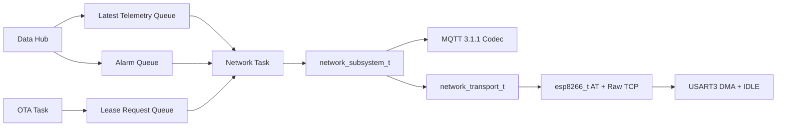

# ESP8266 Raw TCP MQTT 接线与板端验收

## 当前状态

本阶段状态为 **Host Verified + ARM Build Verified / Board Unverified**。源码、CubeMX、Host Mock 与 ARM 构建门禁已经接通，但尚未连接 ESP8266、Wi-Fi AP 或 MQTT Broker，也没有采集真实串口波形。

## 硬件映射

| STM32F407 | 方向 | ESP8266 | 配置 |
|---|---|---|---|
| PB10 / USART3_TX | MCU 输出 | RX | 115200, 8-N-1 |
| PB11 / USART3_RX | MCU 输入 | TX | 115200, 8-N-1 |
| GND | 公共参考 | GND | 必须共地 |
| 外部稳定 3.3 V 电源 | 供电 | VCC/EN | 不使用 GPIO 直接供电 |

PB10/PB11 在 `.ioc` 中分别配置为 USART3 TX/RX，RX 使用 DMA1 Stream1，TX 使用 DMA1 Stream3，中断优先级均为 6。具体霸天虎 V2 板卡排针位置和板载复用必须按手中板卡原理图再次核对，核对前保持 Board Unverified。

## 软件链路

- `esp8266_t` 只理解 AT 命令、`+IPD` 和 TCP 字节流。
- `network_transport_t` 是函数指针接口，隔离具体网络设备并支持 Host Mock。
- `network_subsystem_t` 负责 MQTT、QoS 1、告警优先、遥测合并、Keep Alive、退避重连和 OTA 租约。
- Network Task 是 ESP8266 唯一所有者；ISR 只发送 Task Notification，不解析 AT 或 MQTT。

## 上板前配置

在 `firmware/platform/stm32f407/include/f407_board_config.h` 修改：

- `F407_WIFI_SSID`、`F407_WIFI_PASSWORD`。
- `F407_MQTT_BROKER_HOST`、`F407_MQTT_BROKER_PORT`。
- `F407_MQTT_DEVICE_ID`、`F407_MQTT_CLIENT_ID`。
- 可选的 Broker 用户名和密码。

当前方案是局域网明文 TCP MQTT 演示，不包含 TLS、证书校验或安全凭据存储，不能描述为生产级安全通信。SSID 和密码当前是源码占位宏，后续 CLI/Config 阶段应迁移到带 CRC 的配置 A/B 副本。

## 协议行为

- 首次 PUBLISH 使用 QoS 1、DUP=0 和非零 Packet ID。
- 收到同 Packet ID 的 PUBACK 后才释放在途消息。
- PUBACK 超时、TCP 断线或 OTA 租约结束后，使用原 Packet ID 且 DUP=1 重发。
- 告警保留有界 backlog；普通遥测只保存最新值，防止离线期间旧遥测挤占告警。
- 消息携带 `device_id + boot_id + sequence/event_id`，Broker 后端可据此做业务去重。

## OTA 边界

OTA Task 可请求 Network Task 关闭 MQTT 并取得 OTA 租约，释放后 MQTT 自动恢复。HTTP Manifest/package 请求仍由 Network Task 内的 `http_client_raw_t` 执行；OTA Task 只通过指针 Queue + Task Notification 调用，不直接访问 ESP8266。下载后的 W25Q128 staging 写入同样交给 Storage Task。`ota start` 只下载并验证，`ota apply` 才显式提交 pending，原有 A/B 分区、包格式、trial boot 和 rollback 语义没有改变。详细设计见 `ota_update_design_and_validation.md`。

## 板端验收清单

- [ ] 核对开发板版本及 PB10/PB11 排针没有与其他模块冲突。
- [ ] 记录 ESP8266 模块型号、AT 固件版本、供电方式和 EN/RST 电平。
- [ ] 上电后依次确认 `AT`、`ATE0`、Station 模式、关联 AP 和单连接模式响应。
- [ ] 用逻辑分析仪确认 115200 8-N-1、DMA TX 完成与 IDLE RX 分帧。
- [ ] Broker 侧确认 CONNECT、CONNACK、QoS 1 PUBLISH 和 PUBACK。
- [ ] 丢弃一次 PUBACK，确认同 Packet ID 且 DUP=1 的有限重发。
- [ ] 断开 AP/Broker 后恢复，确认指数退避、告警优先和最新遥测合并。
- [ ] 在 QoS 1 在途时申请/释放 OTA 租约，确认重连后恢复该消息。
- [ ] 执行 `ota check/start/cancel`，观察 ESP8266 长 `+IPD` 分片、HTTP Content-Length 和租约恢复。
- [ ] 连续运行至少 1 小时，记录 Keep Alive、队列水位、任务栈和掉线次数。
- [ ] 完成以上证据后再将对应项标记为 Board Verified。

## 源码索引

- `firmware/app/devices/include/esp8266.h`
- `firmware/app/devices/include/network_transport.h`
- `firmware/app/protocols/include/mqtt_codec.h`
- `firmware/app/subsystems/include/network_subsystem.h`
- `firmware/app/rtos/src/app_rtos.c`
- `firmware/platform/stm32f407/src/f407_network_port.c`
- `firmware/platform/stm32f407/src/f407_uart_dispatch.c`
- `tests/host/network_mqtt/test_network_mqtt.c`

## 参考资料

- [Espressif ESP8266 ESP-AT TCP/IP 命令](https://docs.espressif.com/projects/esp-at/en/release-v2.1.0.0_esp8266/AT_Command_Set/TCP-IP_AT_Commands.html)
- [OASIS MQTT 3.1.1 规范](https://docs.oasis-open.org/mqtt/mqtt/v3.1.1/mqtt-v3.1.1.html)
