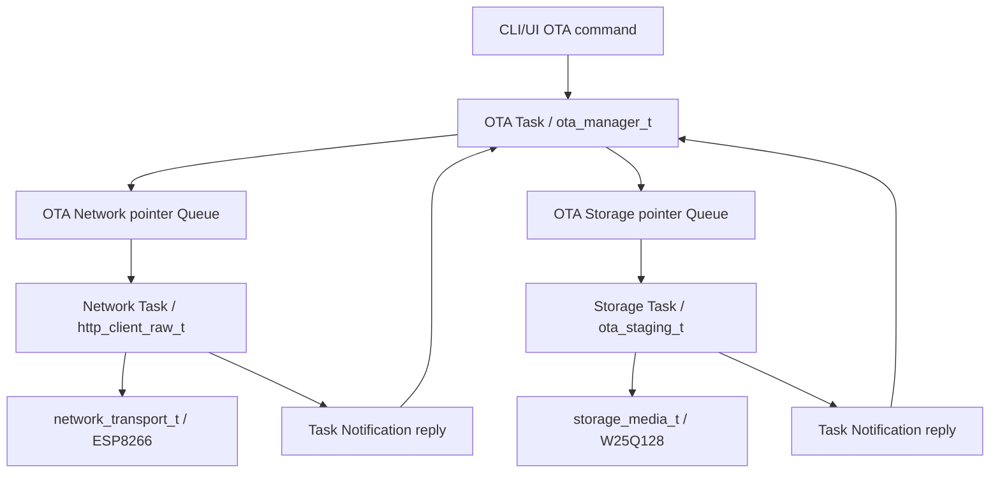
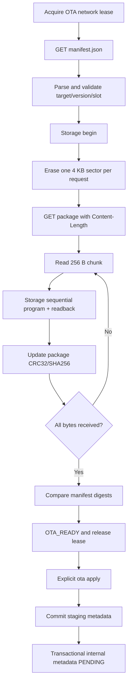

# STM32F407 在线 OTA 下载设计与验收

## 当前验证结论

- HTTP 解析、OTA 状态机、W25Q128 staging 约束和 Python 打包工具：**Host Verified**。
- App A/B 与 Bootloader 编译、链接、分区和关键符号门禁：**ARM Build Verified**。
- ESP8266 实际下载、W25Q128 擦写、apply 后重启安装、trial 确认和 rollback：**Board Unverified**。

本阶段保持既有 `image_header + raw_app.bin` 包格式、内部 Flash A/B 分区、236 B staging metadata、Bootloader 安装和 pending/trial/rollback 语义不变。

## 对象与所有权

| 对象 | 所有者 | 职责 |
|---|---|---|
| `http_client_raw_t` | Network Task | URL、GET、Header、Content-Length 和流式 body |
| `ota_manager_t` | OTA Task | Manifest 策略、状态转换、CRC32/SHA256 和 pending 提交 |
| `ota_staging_t` | Storage Task | staging 擦除、顺序写、读回验证和 metadata 写入 |
| `network_subsystem_t` | Network Task | MQTT 与 OTA TCP 租约切换 |
| `boot_confirmation_t` | OTA Task | trial 固件健康确认，与远端检查命令分离 |



Queue 中只传递当前同步请求的指针。请求对象和 256 B 下载缓冲在 OTA Task 返回前保持有效，Network/Storage Task 完成后再通过 Notification 回执，因此不需要在 Queue 内复制 768 B Manifest 或固件块。

## CLI 事务语义

| 命令 | 行为 | 是否改写 Boot Metadata |
|---|---|---|
| `ota status` | 显示状态、租约、进度、目标槽、摘要结果和最后错误 | 否 |
| `ota check` | 获取并验证 Manifest，随后释放网络租约 | 否 |
| `ota start` | 重新检查、擦除 staging、下载、读回并验证完整包 | 否 |
| `ota apply` | 写 staging metadata，再提交内部 `PENDING` | 是 |
| `ota cancel` | 请求中止，等当前 I/O 安全结束后关闭连接并释放租约 | 否 |

`start` 和 `apply` 有意分离。下载成功只进入 `OTA_READY`；只有明确执行 `apply` 才进入 `OTA_REBOOT_PENDING`。当前代码不自动调用系统复位，后续板端验收时由操作者确认状态后手动复位。

Supervisor 的启动确认使用内部 `GATEWAY_OTA_COMMAND_CONFIRM_BOOT`，不再冒用远端 `CHECK`。它仍要求八个关键任务连续健康 2 秒后才提交 trial `boot_ok`。

## 下载与写入顺序



约束：

- Manifest `image_size` 必须等于 HTTP `Content-Length`。
- staging 只接受 `offset == next_write_offset`，不允许跳写或覆盖。
- 单次写入最大 256 B，与 W25Q128 page 对齐策略一致。
- package 未完整写入时拒绝提交 staging metadata。
- 任一下载、Flash、CRC32 或 SHA256 错误都进入 `OTA_FAILED`，不会提交 pending。
- OTA 等待 I/O 时每 100 ms 更新心跳并检查 cancel；Storage 每完成一个 sector 擦除更新一次心跳。
- OTA Supervisor 窗口为 6 s，覆盖 STM32 内部 Metadata sector 擦除的阻塞上限；Storage 窗口为 4 s，覆盖单个 W25Q128 sector 操作，IWDG 总窗口仍为 12 s。

## 两层摘要

1. `image_header_t.image_crc32/image_sha256`：覆盖 raw App body。
2. Manifest 与 Boot Metadata 的 CRC32/SHA256：覆盖 `image_header + raw App body` 完整 package。

这样下载阶段可以发现完整包损坏，Bootloader 安装阶段还能独立检查 Header、body、目标槽、链接地址和向量表。

CRC32/SHA256 只能检测意外损坏，不能证明发布者身份。当前 Raw HTTP 适用于可信实验局域网；生产化需要固件签名或可信 TLS 终端。

## F407 打包工具

Slot A 链接地址为 `0x08020000`，Slot B 为 `0x08080000`，每个 App body 上限为 256 KB。不能使用旧 F1 工具中的地址和 222 KB 上限。

生成 Slot B package：

```powershell
python tools\pack_firmware.py `
  build\release\artifacts\f407_app_b.bin `
  build\release\artifacts\ota\f407_app_b_v2.0.0.pkg `
  --slot B --version 2.0.0 --git-sha local `
  --min-bootloader-version 1.0.0
```

生成 Manifest：

```powershell
python tools\gen_manifest.py `
  build\release\artifacts\ota\f407_app_b_v2.0.0.pkg `
  build\release\artifacts\ota\manifest.json `
  --download-url http://192.168.1.100/ota/f407/f407_app_b_v2.0.0.pkg `
  --release-note "F407 OTA release"
```

设备获取 Manifest 的地址由 `F407_OTA_MANIFEST_URL` 配置。Manifest 中的 package URL 可以不同，但当前只允许 `http://`。

## Host 与 ARM 证据

Host C 测试覆盖：

- HTTP Header/body 跨多次 receive 的分片组合。
- HTTPS、chunked、非 200 响应拒绝。
- staging 擦除完成前禁止写、offset 顺序约束、逐块读回和 metadata 提交。
- Manifest 校验、inactive slot、完整包 CRC32/SHA256、pending 提交和 CRC 失败不提交。
- CLI `check/start/apply/cancel` 解析。

Python 测试覆盖：

- F407 Slot A/B 链接地址。
- Header body 摘要与 Manifest package 摘要。
- 错误链接地址、包损坏和超 256 KB raw image 拒绝。

最终门禁：Host C/Python `11/11`，ARM Debug/Release 均通过。Release App A/B Flash 分别为 201,244/201,252 B，RAM 102,648 B；由当前 Slot B 重新生成的示例 package 为 201,400 B，Manifest 尺寸与文件一致。

## 板端验收清单

- [ ] 将 SSID、密码、Manifest 地址和 HTTP 文件服务器改为实际局域网配置。
- [ ] 验证 `ota check` 后 MQTT 租约释放并恢复 QoS 1 在途消息。
- [ ] 逻辑分析 USART3 DMA/IDLE、ESP8266 `+IPD` 分片和长包连续下载。
- [ ] 下载中断网、服务器提前关闭、Content-Length 错误、CRC/SHA 错误均不得出现 pending。
- [ ] 下载中执行 `ota cancel`，确认连接关闭、租约释放且当前已写 staging 不会被 Bootloader 安装。
- [ ] `ota start` 成功后断电重启，确认未执行 `apply` 时仍启动原槽。
- [ ] `ota apply` 后检查 staging metadata 和内部 Metadata，再手动复位验证 inactive slot 安装。
- [ ] 验证 trial 健康确认、IWDG/HardFault 未确认回滚、版本和槽位显示。
- [ ] 测量连续 sector 擦除期间 Storage/OTA 心跳和 IWDG 余量。

以上项目完成并留存串口、Flash、波形和复位证据后，才能把在线 OTA 标记为 Board Verified。
