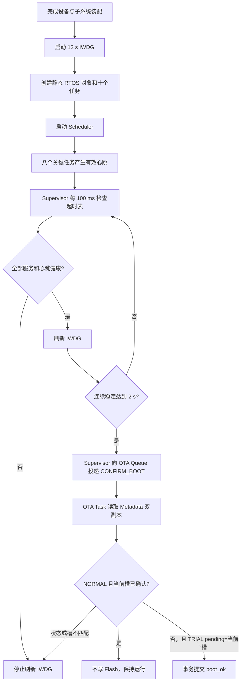

# Supervisor、IWDG 与低功耗基线验证

## 当前验证等级

本阶段状态为 **Host Verified + ARM Build Verified**，不是 **Board Verified**。

- Host 已验证：Power Lock、Tickless 门禁、Deep Power 状态机/回退、W25Q128 幂等休眠、Network Suspend/Resume、应用临界区统计、Supervisor 心跳、trial `boot_ok`、故障记录和 CLI 解析。
- ARM 已验证：App A/B 均链接 Supervisor、Power Manager、六任务静默屏障、深睡控制器、W25Q128 Eco 自动休眠、IWDG、boot confirmation、RTC 异常记录、DWT/FreeRTOS 运行统计及 CLI 路由。
- 尚未验证：真实异常后的 RTC/W25Q128 掉电保持、IWDG 超时精度、任务卡死复位、trial 确认与回滚、CPU/周期统计准确度、休眠电流和长时间稳定性。

## 实现文件

- `firmware/app/devices/include/watchdog_device.h`
- `firmware/app/devices/src/watchdog_device.c`
- `firmware/app/devices/include/fault_recorder.h`
- `firmware/app/devices/src/fault_recorder.c`
- `firmware/app/subsystems/include/supervisor_subsystem.h`
- `firmware/app/subsystems/src/supervisor_subsystem.c`
- `firmware/app/subsystems/include/power_manager.h`
- `firmware/app/subsystems/src/power_manager.c`
- `firmware/app/subsystems/include/deep_power_controller.h`
- `firmware/app/subsystems/src/deep_power_controller.c`
- `firmware/app/subsystems/include/critical_timing_monitor.h`
- `firmware/app/subsystems/src/critical_timing_monitor.c`
- `firmware/app/subsystems/include/boot_confirmation.h`
- `firmware/app/subsystems/src/boot_confirmation.c`
- `firmware/app/subsystems/include/periodic_timing_monitor.h`
- `firmware/app/subsystems/src/periodic_timing_monitor.c`
- `firmware/app/subsystems/include/storage_subsystem.h`
- `firmware/app/subsystems/src/storage_subsystem.c`
- `firmware/app/rtos/src/app_rtos.c`
- `firmware/platform/stm32f407/src/f407_reliability_port.c`
- `firmware/platform/stm32f407/src/f407_fault_capture.c`
- `firmware/platform/stm32f407/src/f407_interrupts.c`
- `firmware/platform/stm32f407/src/platform_f407.c`
- `tests/host/reliability_power/test_reliability_power.c`
- `tests/host/sensor_acquisition/test_sensor_acquisition.c`
- `tests/host/control_storage/test_control_storage.c`

## 启动与确认顺序



`boot_ok` 不在 Scheduler 启动前提交。只有当前运行槽与 trial `pending_slot` 一致，并且关键任务连续健康 2 秒后，Supervisor 才投递有界请求，由 OTA Task 调用 `boot_meta_confirm_boot_ok()`；写入失败会锁存 Supervisor 故障并停止喂狗，让 Bootloader 在复位后执行既有回滚策略。Supervisor 本身不执行 Flash 擦写。

## 心跳超时矩阵

| 任务 | 超时 | 是否参与喂狗门禁 |
|---|---:|---|
| Acquisition | 500 ms | 是 |
| Data Hub | 2000 ms | 是 |
| Modbus | 2500 ms | 是 |
| CAN | 500 ms | 是 |
| Network | 2500 ms | 是 |
| OTA | 6000 ms | 是 |
| Storage | 4000 ms | 是 |
| UI | 500 ms | 是 |
| CLI | - | 否，CLI 故障不能阻止工业闭环运行 |
| Supervisor | - | 自检任务，不检查自身计数 |

启动宽限为 3500 ms。关键任务至少产生一次有效心跳后才进入健康集合；后续计数在对应超时内没有变化即标记 stale，并停止刷新 IWDG。

## Power Lock 矩阵

| Lock | 当前所有者 | 生命周期 | 最深允许模式 |
|---|---|---|---|
| `PM_LOCK_OTA` | Network Task | OTA 网络租约有效期间 | Tickless Sleep |
| `PM_LOCK_FLASH_WRITE` | Storage/Supervisor | W25Q 写事务或 boot Metadata 提交 | Active |
| `PM_LOCK_NETWORK_TX` | Network Task | 单次网络状态机处理 | Tickless Sleep |
| `PM_LOCK_MODBUS_TRANSACTION` | Modbus Task | 单次请求/响应事务 | Tickless Sleep |
| `PM_LOCK_CAN_MONITORING` | CAN Task | 在线监听期间长期持有 | Tickless Sleep |
| `PM_LOCK_UI_ACTIVE` | UI Task | GT911 触摸后短时保持 3 s | Active |
| `PM_LOCK_ALARM_ACTIVE` | Supervisor | 活动告警期间 | Active |

每个 Lock 使用引用计数。首次获取记录时间，最后一次释放才清除位；重复释放、计数溢出和非持久 Lock 长期占用进入统计。CAN 在线监听和持续告警是显式持久 Lock，不误报为泄漏。

## Tickless 门禁

FreeRTOS Cortex-M4F Port 在调用 `configPRE_SLEEP_PROCESSING()` 前已经按原始 idle tick 装载 SysTick，因此预处理回调只能接受原始周期或取消 WFI，不能安全地把周期改短。本工程采用以下规则：

1. 预计空闲时间小于 5 ms，取消本次 Tickless Sleep。
2. Active 级 Power Lock 存在，取消本次 Tickless Sleep。
3. 预计空闲时间超过“IWDG 剩余时间 - 1500 ms”，取消本次 Tickless Sleep。
4. 其余情况保持原始 tick 预算进入 Cortex-M Sleep。

CLI 中的 `planned_ms` 是获准的休眠预算上限，不是板端测得的实际休眠时长。Tickless Post Hook 使用不清除 SysTick COUNTFLAG 的 `SCB->ICSR.PENDSTSET` 区分 SysTick 与其他中断唤醒；具体 EXTI 源仍需上板读取外设 pending flag 才能细分。

## 深睡静默屏障

`power stop MS CONFIRM` 与 `power standby CONFIRM` 先进入 HAL-free `deep_power_controller_t`，不会直接调用 STM32 HAL。Supervisor 设置 Event Group 请求后，Acquisition、Modbus、CAN、Network、Storage、UI 分别在自己的任务上下文执行 Suspend 并提交 ACK；只有全部 ACK、Power Lock 最深模式和 IWDG 窗口同时满足，控制器才允许调用平台 Ops。请求结束或失败后 Supervisor 清除请求，各任务按所有权恢复对象。

当前 F407 配置把 `F407_STOP_PERIODIC_ENABLED` 与 `F407_STANDBY_SHIPPING_ENABLED` 固定为 0，因此命令返回 `ERR_UNSUPPORTED`，不会执行 `HAL_PWR_EnterSTOPMode()` 或 Standby。原因是 RTC/EXTI 唤醒源、FreeRTOS 时间补偿、PLL/总线时钟恢复和外设重初始化尚无板端证据；仅把“接口已存在”写成“可安全进入 STOP”会制造不可恢复的假闭环。

Storage Task 的 Eco 策略已经实际接线：Power Manager 处于 Eco、Queue Set 连续空闲 5 s、无 OTA 活动时，唯一 Flash 所有者让 W25Q128 进入 Deep Power-down；后续任意日志、告警、配置或 OTA 请求都先唤醒再处理。ESP8266 保持在线 Modem-sleep，初始化和重连均发送 `AT+SLEEP=2`，不在 MQTT 连续在线场景强行断电。

## CLI 诊断

```text
rtos
rtos task
rtos queue
rtos runtime
rtos timing
power status
power stats
power lock
power stop 5000 CONFIRM
power standby CONFIRM
power cancel
slot status
fault show
fault clear
fault inject hardfault CONFIRM
fault inject watchdog CONFIRM
```

- `rtos`：Supervisor 健康状态、stale mask、喂狗次数和十任务心跳。
- `rtos task`：各任务 Stack High Water Mark，单位为 words。
- `rtos queue`：十五条业务 Queue 当前深度与历史高水位，包含 OTA Network/Storage 请求队列和 Supervisor Power Command 队列。
- `rtos runtime`：十个业务任务、Idle 和其他内核任务最近一个采样窗口的 CPU 千分比；首次采样只建立基线。
- `rtos timing`：Acquisition Task 的 100 ms 目标周期、2 ms 释放容差、实际周期最小/最大值、最近抖动、最大提前/延迟和超期次数。
- `power status/stats/lock`：模式、策略、最深允许模式、IWDG 剩余估算、Lock、六任务 ACK、Deep Power capability/状态、W25 休眠次数和临界区最长 DWT 周期。
- `power stop/standby/cancel`：带确认令牌的深睡请求与撤销；当前 F407 capability 关闭时必须返回 `ERR_UNSUPPORTED`。
- `slot status`：当前运行槽、Metadata active/pending/state、确认次数和最后错误。
- `fault show`：优先读取 CRC 有效的 RTC 备份域 cookie；无 RTC cookie 时回退读取 Storage RAM 中缓存的 W25Q128 最新归档，并显示 `source=rtc|w25`、异常来源、任务 token、PC/LR/xPSR 与 SCB 故障寄存器。
- `fault clear`：只清除已回读的 RTC 备份域 cookie，不擦除 W25Q128 Crash 历史；清除后 `fault show` 仍可显示 `source=w25`。
- `fault inject ... CONFIRM`：仅 Debug 固件可用。HardFault 注入执行未定义指令并立即复位；Watchdog 注入先写 cookie，再阻断 IWDG 刷新。Release 固件在链接门禁中要求移除两个平台注入符号。

## 异常记录与运行统计边界

`HardFault_Handler`、`MemManage_Handler`、`BusFault_Handler` 和 `UsageFault_Handler` 只完成最小现场捕获：根据 `EXC_RETURN` 选择 MSP/PSP，记录自动压栈寄存器、SCB 故障状态、当前任务 token 和序号，使用 CRC32 封装为 19 个 32 位字。写入顺序为先清 magic、再写正文和 CRC、最后提交 magic，避免掉电或二次异常留下看似有效的半条记录。

记录首先位于 STM32F407 的 RTC Backup Register，不依赖 Scheduler、W25Q128 或动态内存，软件复位和 IWDG 复位后可回读。Scheduler 启动后由唯一拥有外部 Flash 的 Storage Task 读取有效 cookie，在持有 `PM_LOCK_FLASH_WRITE` 时追加到 W25Q128 Crash 环形区；记录同时校验 128 B 外层记录 CRC 与 76 B `fault_record_t` 内层 CRC，并按 `sequence + crc32` 去重。

Crash 挂载会扫描全部有效扇区代际，而不是只看最新扇区。因此“新扇区头已提交、首条 Crash 记录写坏或掉电”的情况下仍能回退到上一代最后一条有效记录。该行为已经通过内存 Flash Mock 验证，真实 W25Q128 的掉电时序与数据保持仍需上板确认。

FreeRTOS 使用 `configGENERATE_RUN_TIME_STATS=1` 和 `configUSE_TRACE_FACILITY=1`，DWT `CYCCNT` 作为运行时间基准。Supervisor 每秒调用 `uxTaskGetSystemState()`，通过相邻快照的无符号差值处理 32 位回绕并输出千分比。

Acquisition Task 使用独立 `periodic_timing_monitor_t` 比较 `vTaskDelayUntil()` 的计划释放时刻与实际释放时刻，并统计相邻实际周期。软件统计已经覆盖 32 位毫秒计数回绕，但只能反映任务获得 CPU 的时刻；它不能替代 GPIO 翻转加逻辑分析仪测得的采样开始、总线事务和转换完成时序。

## 板端验收清单

- [ ] 用 ST-LINK 下载 Bootloader、App A 和有效 Metadata/Descriptor，确认正常启动。
- [ ] 连续读取 `rtos task` 和 `rtos queue`，记录 1 小时高水位与队列峰值。
- [ ] 连续读取 `rtos runtime`，对比空闲、UI 刷新、MQTT 上报和总线压力场景，确认总占比与趋势合理。
- [ ] 连续读取 `rtos timing`，记录空闲、Flash 擦除、UI 刷新和总线压力场景下的 min/max、最大抖动与超期次数，并用 GPIO 翻转测量校准。
- [ ] 使用 Debug 固件执行 `fault inject hardfault CONFIRM`，复位后用 `fault show` 核对 origin、PC/LR、CFSR/HFSR 和任务 token，再执行 `fault clear`。
- [ ] 使用 Debug 固件执行 `fault inject watchdog CONFIRM`，确认 CLI 先返回接受结果，随后停止喂狗并在约 12 秒后复位，cookie 标记为 `watchdog-injection`。
- [ ] 故障复位后确认 `fault show` 先显示 `source=rtc`；等待 Storage 归档、执行 `fault clear` 后确认回退显示 `source=w25`，整板断电重启后再次核对记录。
- [ ] 使用 Release 固件确认故障注入返回 `ERR_UNSUPPORTED`。
- [ ] 暂停一个关键任务，确认停止喂狗并在约 12 秒窗口内发生 IWDG Reset。
- [ ] 构造 App B trial，确认八任务稳定 2 秒后才提交 `boot_ok`。
- [ ] 在确认前制造任务卡死，确认 Bootloader 识别 IWDG Reset 并回滚 App A。
- [ ] 在 Storage 写入与 Metadata 提交期间确认 `PM_LOCK_FLASH_WRITE` 阻止 Tickless。
- [ ] 分别记录无锁、CAN 长期锁、活动告警和 OTA 租约下的 `power status`。
- [ ] 使用功耗仪测量 Active/Eco/Tickless 的实际平均值和峰值，不用 `planned_ms` 代替实测。
- [ ] 连续运行至少 1 小时，确认采集、UART、CAN、MQTT Keep Alive 和 IWDG 无异常复位。

## 当前未完成

- 应用自有临界区最长 DWT 周期已经统计；FreeRTOS 内核/ISR 的完整中断关闭时间和 GPIO/逻辑分析仪证据仍待板端。
- ESP8266 `AT+SLEEP=2` 与 W25Q128 空闲自动 Deep Power-down 已接线；真实模块兼容性、唤醒延迟和节电幅度待实测。
- STOP/Standby 软件门禁与任务恢复链已完成，但平台 capability 默认关闭；RTC/EXTI 唤醒、时间补偿、时钟树和外设恢复仍需板端完成。
- 板端故障注入、CPU 统计校准与功耗实测证据。
