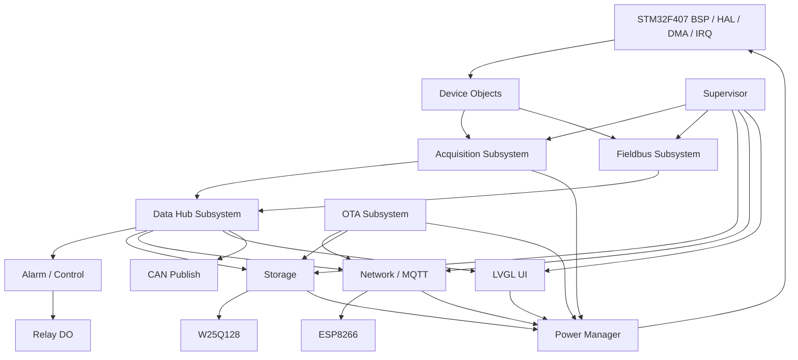
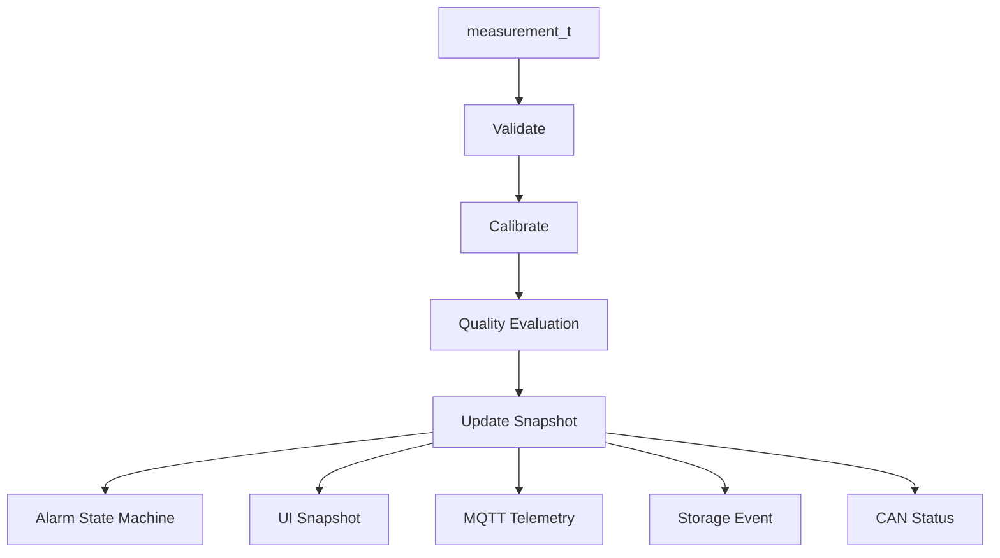
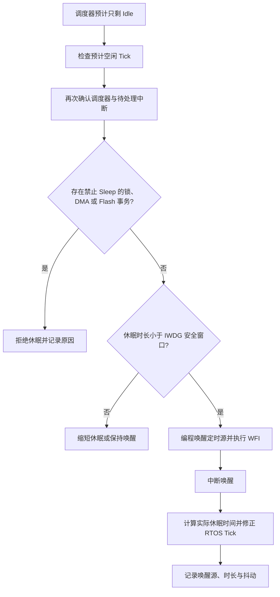

# STM32F407 工业多协议采集与 A/B OTA 边缘终端设计方案

> 文档状态：目标架构设计基线  
> 目标平台：野火 STM32F407 霸天虎 V2 / STM32F407ZGT6  
> 项目定位：求职简历与面试展示优先，同时完成可上板运行的工业采集闭环  
> 迁移原则：保留现有 A/B OTA 协议与状态语义，重构 Application、BSP 和业务数据链

## 当前实现状态

截至本阶段，以下状态严格区分验证层级：

| 模块 | 当前状态 | 证据与边界 |
|---|---|---|
| I2C/SPI 端口对象、设备健康、统一测点 | Host Verified + ARM Build Verified | 不依赖 HAL/FreeRTOS，可使用 Mock 验证 |
| ADS1115 | Host Verified + ARM Build Verified | Single-shot、PGA/速率、定点电流换算及 I2C1 HAL 端口；未连接实物 |
| MAX31865 | Host Verified + ARM Build Verified | Bias、One-shot、Fault、CVD 换算及 SPI2 HAL 端口；未连接实物 |
| SHT30 | Host Verified + ARM Build Verified | Single-shot、等待时间、CRC、温湿度换算及 I2C1 HAL 端口；未连接实物 |
| Acquisition Subsystem | Host Verified + ARM Build Verified | Composition Root、独立周期、质量码、单设备故障降级、自动重试、FreeRTOS Queue 发布及 100 ms 周期抖动/超期统计 |
| RS485 Bus / Modbus RTU Master | Host Verified + ARM Build Verified | 对象接口、`0x03/0x04`、CRC、字序缩放、异常、超时重试及 USART2 DMA/IDLE 端口；未连接从站 |
| CAN Bus / CAN Protocol | Host Verified + ARM Build Verified | 对象接口、标准帧测点协议、RX 通知、发送队列及 bus-off 延时恢复；未连接 CAN 节点 |
| Fieldbus Subsystem | Host Verified + ARM Build Verified | Composition Root、Modbus/CAN Facade、Measurement Queue 汇聚和 Data Hub CAN TX Queue 扇出 |
| Alarm / Relay | Host Verified + ARM Build Verified | 高低限、连续样本、恢复滞回、质量故障安全态、事件 ID、PG2 HAL 端口；未连接继电器模块 |
| W25Q128 / Storage | Host Verified + ARM Build Verified | JEDEC/分页写/扇区擦除、CRC 记录、日志/告警/Crash 环形区、配置 A/B 回退、Queue Set 单所有者；未做实物擦写与掉电测试 |
| ESP8266 / Raw TCP | Host Verified + ARM Build Verified | AT 初始化、TCP 收发、分片 `+IPD`、USART3 DMA/IDLE 端口；未连接模块 |
| MQTT / Network Subsystem | Host Verified + ARM Build Verified | QoS 1、PUBACK、DUP、告警优先、遥测合并、Keep Alive、退避重连和 OTA 网络租约 |
| LVGL / UI Page Manager | Host Verified + ARM Build Verified | LVGL v9.5.0、六页 Page Ops、双缓冲降级、GT911 Notification 和 UI Power Lock；未做实机验证 |
| USART1 CLI | Host Verified + ARM Build Verified | Circular DMA + IDLE、ISR 环形缓冲与 Task Notification、命令解析和诊断输出；未验证真实串口波形 |
| Config Subsystem | Host Verified + ARM Build Verified | active/staged 配置、revision、活动告警门禁、Alarm 重配置、Storage 提交与失败回滚 |
| Reliability / RTOS Diagnostics | Host Verified + ARM Build Verified | RTC fault cookie、W25Q128 去重归档、DWT CPU 千分比、Stack/Queue 高水位与采集周期统计；未做板端校准 |
| 传感器与真实开发板 | 未验证 | 引脚和接线约束已固化，仍需 ST-LINK、逻辑分析仪和真实模块验证 |
| RS485/CAN 与真实开发板 | 未验证 | PA2/PA3/PC0、PB8/PB9 映射已进入 ARM 门禁，仍需跳帽、收发器、终端电阻、波形和故障恢复验证 |
| Relay/W25Q128 与真实开发板 | 未验证 | PG2 与 SPI1 PB3/PB4/PB5 + PG6 已进入 ARM 门禁，仍需核对板型、JEDEC ID、极性、波形、掉电和寿命行为 |
| ESP8266/MQTT 与真实开发板 | 未验证 | PB10/PB11 与 DMA 已进入 ARM 门禁，仍需模块供电、AT 固件、AP/Broker、波形、断网重发和去重验证 |

当前默认调度基线为 Acquisition Task 每 100 ms 唤醒；ADS1115、MAX31865、SHT30 分别使用可配置的独立采样周期。设备驱动使用单次转换，空闲时 ADS1115 回到 Power-down、MAX31865 关闭 Bias、SHT30 Heater 保持关闭。该策略已有源码与 Host 证据，但整板功耗结论仍必须来自后续实测。

现场总线阶段的当前基线为 Modbus Task 每 1 s 轮询一次配置表，通过 USART2 DMA TX、Receive-to-IDLE DMA RX 和 PC0 方向控制访问 RS485；CAN Task 由 CAN RX/错误中断通过 Direct-to-Task Notification 唤醒，接收测点统一发布到 Measurement Queue，Data Hub 则经独立 CAN TX Queue 发送本地测点。对象装配、协议和 RTOS 数据链已有 Host/ARM 证据，所有收发器和真实节点行为仍为 Board Unverified。

告警与存储阶段的当前基线为 Data Hub 对每个统一测点先执行 Alarm Subsystem，再更新快照并分别投递遥测、告警和持久化请求。Relay 通过对象 API 执行 active-high 输出和配置安全态；Storage Task 通过 Queue Set 聚合日志、告警、配置三类请求并按优先级写入 W25Q128。算法、协议和持久化恢复已有 Host/ARM 证据，真实继电器动作、JEDEC ID、擦写掉电和长期寿命仍为 Board Unverified。

网络阶段的当前基线为 Network Task 单独拥有 ESP8266 和 USART3，Data Hub 通过“告警不可覆盖、普通遥测只保留最新值”的独立 Queue 扇出数据。MQTT 3.1.1 使用一条 QoS 1 在途消息，按 Packet ID 匹配 PUBACK，超时、断线或 OTA 租约释放后使用 DUP 重发；重连截止时间由 Network Task 周期状态机维护。Host/ARM 证据已完成，真实模块、AP、Broker 和网络故障行为仍为 Board Unverified。

UI/CLI 阶段的当前基线为 UI Task 单独拥有 LVGL，Data Hub 只覆盖写入最新系统快照，CLI 通过独立 Queue 请求页面跳转。USART1 ISR 只搬运 Circular DMA 新字节并发送 Task Notification，解析和业务分派全部在 CLI Task。LCD/GT911、FSMC/SRAM 和 UI 低功耗端口已完成 Host/ARM 证据；真实控制器 ID、总线时序、触摸方向和功耗仍为 Board Unverified。

## 1. 项目概述

本项目是一套运行在 STM32F407ZGT6 + FreeRTOS 上的工业边缘采集终端。终端同时采集本地 4-20 mA 过程量、PT100 温度、环境温湿度、Modbus RTU 仪表和 CAN 节点数据，将不同来源的数据转换为统一工业测点模型，再完成质量判断、越限告警、继电器输出、W25Q128 持久化、LVGL 本地显示和 MQTT QoS 1 上报。系统通过 Tickless Idle、分级电源模式、外设占空比和电源锁机制降低空闲功耗，同时保证采集、告警和 OTA 的可靠性优先级高于节能目标。

系统继续使用 A/B Application、外部 Flash staging、Manifest、CRC32/SHA256、trial boot、boot-ok 和异常回滚完成远程升级。OTA 的业务协议、状态机和安全语义不变，只迁移与 STM32F407 硬件有关的内部 Flash Sector、链接地址、启动文件、HAL 和 W25Q128 接口。

### 1.1 一句话业务闭环

```text
采集真实物理量 -> 标准化测点 -> 判断数据质量 -> 产生告警
-> 驱动继电器 -> 保存记录 -> LVGL 展示 -> MQTT/CAN 上报
```

### 1.2 简历项目名称

**基于 STM32F407 + FreeRTOS 的工业多协议采集与 A/B OTA 边缘终端**

### 1.3 设计目标

- 建立有真实生产者、传输通道和消费者的数据闭环，不保留孤立 Queue 或空业务资源。
- 通过任务划分、优先级、队列、队列集、互斥量、信号量、事件组和任务通知体现 FreeRTOS 应用深度。
- 使用 C 语言面向对象、接口隔离和依赖注入降低设备、子系统、RTOS 与 HAL 之间的耦合。
- 建立统一 Power Manager，在不破坏实时性、通信和看门狗的前提下管理 MCU 与外设低功耗状态。
- 形成可解释、可测试、可观测、可故障注入和可上板演示的工程证据。
- 控制功能范围，不继续增加 CANopen、TLS、文件系统、Ethernet 等非主线模块。

## 2. 项目边界

### 2.1 第一版必须完成

- ADS1115 + 采样电阻采集一路 4-20 mA 过程信号。
- MAX31865 + 三线 PT100 采集工业温度并检测开路、短路。
- SHT30 采集终端环境温湿度。
- Modbus RTU Master 周期读取远端仪表。
- CAN 节点状态接收、终端状态发送和 bus-off 恢复。
- 统一测点、质量码、校准、告警回差和一路 Relay DO。
- W25Q128 日志、配置、故障记录和 OTA staging。
- ESP8266 Raw TCP MQTT 3.1.1 QoS 1 遥测和告警上报。
- LVGL 工业监控、趋势、告警、状态和参数页面。
- A/B OTA 下载、校验、pending、trial、boot-ok 和回滚。
- CLI、任务心跳、栈水位、CPU 占用、Queue 高水位和故障注入。
- FreeRTOS Tickless Idle、LCD/ESP8266/传感器节能策略、低功耗锁、唤醒原因和功耗测试。

### 2.2 第一版不包含

- CANopen、J1939、Modbus TCP、TLS 和云端设备管理平台。
- Linux 网关、数据库、SD 卡、FatFs 和完整历史趋势数据库。
- 市电负载控制、量产级隔离认证、EMC 和安规认证。
- 复杂 LVGL 动画、自研控件库和多语言系统。
- 其他 MCU 平台的新增功能兼容与板端回归。

## 3. 硬件平台

### 3.1 主控与开发板

| 项目 | 选择 |
|---|---|
| MCU | STM32F407ZGT6，Cortex-M4F，168 MHz |
| 开发板 | 野火 STM32F407 霸天虎 V2 |
| 内部 Flash | 1 MB |
| MCU SRAM | 192 KB，包含普通 SRAM 和 CCM |
| 外部 SRAM | 板载 1 MB，用于 LVGL 绘图缓冲和趋势数据 |
| 外部 Flash | 板载 W25Q128，16 MB |
| 调试接口 | SWD，释放与 SPI1 重映射相关的 JTAG 引脚 |

### 3.2 外设分配原则

| 外设 | 设备/用途 | 所有者 |
|---|---|---|
| SPI1 | 板载 W25Q128 | Storage 与 OTA 经 Storage Subsystem 访问 |
| SPI2 | MAX31865 + PT100 | Acquisition Task |
| I2C1 | ADS1115、SHT30 | Acquisition Task |
| GPIO 软件 I2C | GT911：PD7 SCL、PD3 SDA | UI Task |
| USART1 | CLI + DMA RX/TX | CLI Task |
| USART2 | RS485 Modbus RTU Master | Modbus Task |
| USART3 | ESP8266 AT + Raw TCP | Network Task |
| CAN1 | 工业节点状态通信 | CAN Task |
| ADC + TIM + DMA | 板端电压或模拟输入自检 | Acquisition Task |
| FSMC | 4.3 寸 LCD 8080 总线 | UI Task |
| GPIO DO | 隔离继电器模块 | Alarm/Control Subsystem |

最终引脚必须根据霸天虎 V2 原理图生成独立 Pin Map，解决 LCD、外部 SRAM、Ethernet、CAN、RS485、SPI 和 JTAG 复用冲突。本设计只固定外设职责，不在此处提前猜测未核对的引脚。

### 3.3 电源域与低功耗硬件原则

- MCU、LCD 背光、ESP8266、传感器和 Relay 分别统计功耗，不能只测 MCU 数据手册电流。
- LCD 背光使用 PWM 或受控使能，支持调光和关闭；显示控制器休眠命令按实际屏幕驱动实现。
- ESP8266 优先使用 Modem-sleep；只有允许断开 MQTT 的周期上报模式才允许 Light-sleep、Deep-sleep 或硬件 EN 断电。
- ADS1115 使用 Single-shot，MAX31865 只在测量窗口打开 Bias，SHT30 使用单次测量并关闭 Heater。
- W25Q128 空闲且无待处理写操作时进入 Deep Power-down，访问前执行 Release Power-down 并等待器件就绪。
- CAN/RS485 收发器只有在开发板实际引出 Standby/Shutdown 控制脚时才进入硬件休眠，不能仅在软件中假设已经断电。
- Relay 的安全状态优先于节能；若后续自制硬件，可评估磁保持 Relay，第一版不得为省电改变故障安全语义。
- 未使用 GPIO 配置为确定电平或模拟输入，外设断电时避免 MCU IO 反向灌电。

### 3.4 工业输入边界

- 4-20 mA 输入使用 100 ohm 精密采样电阻，将电流转换为约 0.4-2.0 V 电压后送入 ADS1115。
- 输入端增加限流、RC 滤波和必要的浪涌/ESD 保护；未做隔离认证时不得宣称量产级隔离输入。
- Relay DO 只控制安全低压演示负载，不直接切换市电。
- PT100 使用三线制，记录 MAX31865 的开路、短路和参考电阻异常状态。

## 4. 总体软件架构



### 4.1 分层依赖

```text
Application Tasks
    -> Subsystem Facades
        -> Domain / Middleware
            -> Device Interfaces
                -> STM32F407 BSP / FreeRTOS Adapter
```

依赖只能向下。Device、Domain 和 Subsystem 核心代码不包含 STM32 HAL Handle。FreeRTOS Handle 只允许存在于 Task、Channel Adapter、RTOS Resources 和 Platform Port。

### 4.2 Composition Root

系统使用一个静态 `app_context_t` 作为组合根，集中保存所有对象和依赖，不使用业务全局单例：

```c
typedef struct {
    board_t board;
    ads1115_t ads1115;
    max31865_t max31865;
    sht30_t sht30;
    w25qxx_t w25q128;
    esp8266_t esp8266;

    acquisition_subsystem_t acquisition;
    data_hub_subsystem_t data_hub;
    fieldbus_subsystem_t fieldbus;
    storage_subsystem_t storage;
    network_subsystem_t network;
    ui_subsystem_t ui;
    ota_manager_t ota;
    power_manager_t power;
    supervisor_subsystem_t supervisor;

    app_rtos_resources_t rtos;
} app_context_t;
```

初始化顺序固定为：

```text
BSP -> Bus -> Device -> Middleware -> Subsystem -> RTOS Channel
-> Task -> IRQ Hook -> Scheduler
```

对象契约、依赖装配或必需 RTOS 资源创建失败时停止启动，不能带着不完整对象进入 Scheduler。可恢复的外设启动失败则记录状态后降级进入 Scheduler，由各设备或子系统按自己的周期重试；这种降级不能掩盖配置错误，也不能被标记为 Board Verified。

## 5. C 语言面向对象设计

### 5.1 统一对象模式

采用“实例对象 + 常量 Ops 表 + 公开包装函数”：

```c
typedef struct max31865 max31865_t;

typedef struct {
    status_t (*init)(max31865_t *device);
    status_t (*sample)(max31865_t *device, measurement_t *out);
    status_t (*self_test)(max31865_t *device);
    status_t (*get_health)(max31865_t *device,
                           device_health_t *out_health);
} max31865_ops_t;

struct max31865 {
    const max31865_ops_t *ops;
    spi_bus_t *bus;
    max31865_config_t config;
    max31865_state_t state;
};

status_t max31865_sample(max31865_t *device, measurement_t *out);
```

### 5.2 设计规则

- Ops 表使用 `static const`，避免每个实例重复保存函数地址。
- 上层禁止调用 `device->ops->sample()`，统一调用包装函数。
- 包装函数检查空指针、初始化状态、参数范围、调用上下文和错误传播。
- 使用组合代替继承，不设计通用 `void *` 万能基类。
- 只在设备可替换、需要 Host Mock 或存在多实例的边界使用函数指针。
- CRC、滤波、校准和告警计算等纯算法保持普通纯函数。
- 公共 API 文档必须说明单位、阻塞性、线程安全、超时、对象所有权和调用上下文。
- 全部对象静态创建，不使用 `malloc`。

### 5.3 子系统 Facade

每个子系统对任务暴露少量自解释接口：

```c
status_t acquisition_start(acquisition_subsystem_t *self);
status_t acquisition_process(acquisition_subsystem_t *self,
                             uint32_t notification_bits);
status_t acquisition_get_health(const acquisition_subsystem_t *self,
                                subsystem_health_t *out_health);
```

Task 文件只负责等待、接收、调用和上报心跳，不实现设备寄存器、协议解析或业务状态机。

## 6. 工业测点与公共消息

### 6.1 统一测点

```c
typedef enum {
    QUALITY_GOOD = 0,
    QUALITY_STALE,
    QUALITY_COMM_ERROR,
    QUALITY_OUT_OF_RANGE,
    QUALITY_SENSOR_FAULT
} measurement_quality_t;

typedef struct {
    uint16_t point_id;
    uint8_t source;
    uint8_t unit;
    uint32_t sequence;
    uint32_t monotonic_ms;
    uint64_t wall_time_ms;
    int32_t raw_value;
    int32_t engineering_value;
    measurement_quality_t quality;
    status_t error;
} measurement_t;
```

- `monotonic_ms` 用于超时、陈旧判断和调度，不受 RTC/NTP 校时影响。
- `wall_time_ms` 用于日志、告警和上报；未同步时必须携带时间无效标志。
- 工程值优先使用带比例因子的定点数，避免业务层到处使用浮点格式。
- `sequence` 每次发布递增，用于跨 UI、日志、MQTT 和 CAN 追踪同一份数据。

### 6.2 其他公共消息

| 类型 | 用途 |
|---|---|
| `alarm_event_t` | 告警进入、恢复、级别、阈值和事件 ID |
| `system_snapshot_t` | 最新测点、网络、OTA、DO、功耗模式和任务健康状态 |
| `telemetry_message_t` | MQTT 主题、序号、QoS 和固定缓冲句柄 |
| `storage_event_t` | 日志、告警、配置和故障持久化请求 |
| `subsystem_health_t` | 初始化、最后成功时间、错误和统计信息 |

## 7. FreeRTOS 任务设计

### 7.1 任务表

| 任务 | 优先级 | 初始栈 | 触发方式 | 职责 |
|---|---:|---:|---|---|
| Supervisor | 6 | 512 words | 100 ms 周期 | 心跳、统计、功耗策略、IWDG、故障策略 |
| Acquisition | 5 | 768 words | 周期 + DMA Notification | 本地传感器和 ADC 采样 |
| Data Hub | 5 | 768 words | Measurement Queue | 标准化、质量码、告警、扇出 |
| Modbus | 4 | 768 words | 周期 + UART Notification | RS485 RTU Master 轮询 |
| CAN | 4 | 512 words | CAN Notification + TX Queue | CAN 收发和 bus-off 恢复 |
| Network | 4 | 1024 words | Notification + Network Queue | ESP8266、MQTT、HTTP Transport |
| OTA | 3 | 1536 words | OTA Command Queue | 下载编排、校验、pending、重启 |
| Storage | 2 | 768 words | Storage Queue Set | 日志、配置、故障、W25Q128 |
| UI | 2 | 1536 words | 10 ms 周期 + Snapshot Queue | LVGL、页面、触摸、刷新 |
| CLI | 1 | 768 words | UART Notification | 命令解析和诊断输出 |

优先级范围保持在 `configMAX_PRIORITIES = 8` 内。初始栈只是预算起点，最终根据板端 Stack High Water Mark 调整，并保留至少 25% 余量。

### 7.2 调度原则

- Acquisition 使用 `vTaskDelayUntil()` 保持 100 ms 基准周期。
- Modbus 使用独立轮询周期，默认 1 s，不阻塞 Acquisition。
- Data Hub 事件驱动，不轮询生产者状态。
- UI 低于采集和现场总线优先级，复杂绘制不能影响采样。
- OTA、Storage 和 Network 的阻塞操作必须有上限并定期让出 CPU。
- Supervisor 只做有界检查，不在高优先级任务内写大块 Flash 或格式化长日志。

## 8. FreeRTOS 原语映射

### 8.1 Queue

| Queue | 生产者 | 消费者 | 满队列策略 |
|---|---|---|---|
| `q_measurement_ingress` | Acquisition、Modbus、CAN | Data Hub | 记录丢弃计数；告警源不得静默丢失 |
| `q_ui_snapshot` | Data Hub | UI | 长度 1，`xQueueOverwrite()` 保留最新快照 |
| `q_can_tx` | Data Hub、CLI | CAN | 有界等待，失败计数 |
| `q_network_telemetry` | Data Hub | Network | 长度 1，`xQueueOverwrite()` 只保留最新遥测 |
| `q_network_alarm` | Data Hub | Network | 长度 8，满队列计数并设置故障状态 |
| `q_power_command` | CLI | Supervisor | 长度 4，满队列返回错误；深度低功耗控制器保持 Supervisor 单一所有者 |
| `q_network_control` | OTA | Network | 带 `request_id` 的租约获取/释放命令 |
| `q_network_control_result` | Network | OTA | 仅接受 type 与 `request_id` 都匹配的结果 |
| `q_ota_command` | CLI、UI | OTA | 拒绝非法并发命令并返回状态 |
| `q_storage_log` | 各子系统 | Storage | 低级别日志可丢弃，错误日志计数 |
| `q_storage_alarm` | Alarm | Storage | 不静默丢弃，必要时触发系统故障 |
| `q_storage_config` | CLI、UI | Storage | 串行化保存请求 |

小型消息按值复制。大于固定阈值的消息只传递固定内存池句柄，禁止传递栈指针或无所有权约定的裸指针。

### 8.2 Queue Set

Storage Task 需要同时等待三种不同大小、不同语义的消息，因此使用一个 Queue Set：

```text
storage_queue_set
  - q_storage_log      length 32
  - q_storage_alarm    length 8
  - q_storage_config   length 4
  total event slots    44
```

使用 `xQueueSelectFromSet()` 阻塞等待。多个成员同时就绪时先处理告警和配置，再处理普通日志。相同类型的多源测量使用单个 MPSC Queue，不为了展示 API 再引入 Queue Set。

### 8.3 Mutex

| Mutex | 保护对象 | 使用者 | 约束 |
|---|---|---|---|
| `mtx_w25q128` | SPI1 W25Q128 物理操作 | Storage、OTA | 每次只锁有界 Flash 操作，不跨完整下载持有 |
| `mtx_boot_metadata` | Metadata 读取和事务提交 | OTA、boot-ok、CLI | 禁止在持锁期间等待网络 |
| `mtx_config` | RAM 配置快照和版本 | CLI、UI、Storage | 修改后通过 Storage 异步持久化 |
| `mtx_snapshot` | 最新系统快照一致复制 | Data Hub、CLI、Supervisor | 只做短时结构体复制 |

LVGL 不使用跨任务 UI Mutex，而是由 UI Task 单独拥有。ESP8266 由 Network Task 单独拥有。SPI2 和 I2C1 由 Acquisition Task 单独拥有。能通过单所有者消除共享时，优先不加锁。

### 8.4 Counting Semaphore

固定块内存池使用 Counting Semaphore 表示空闲块数量：

```text
take semaphore -> allocate block -> enqueue handle
consumer processes -> release block -> give semaphore
```

普通遥测获取失败时合并为最新值；告警获取失败时记录故障并触发降级，不能继续伪装为已上报。

### 8.5 Event Group

系统事件组固定定义：

```text
SYS_STORAGE_READY
SYS_ACQUISITION_READY
SYS_NETWORK_UP
SYS_MQTT_READY
SYS_OTA_ACTIVE
SYS_FAULT_ACTIVE
SYS_SAFE_TO_REBOOT
SYS_POWER_ECO
SYS_DISPLAY_AWAKE
```

Event Group 只表达持续状态或多任务广播，不传输业务数据。任务启动时等待必要的 READY 位，OTA 重启前等待 `SYS_SAFE_TO_REBOOT`。

### 8.6 Direct Task Notification

Notification 用于 ISR 到唯一任务或轻量内部门铃：

| 来源 | 目标任务 | Notification bit/count |
|---|---|---|
| ADC DMA half/full ISR | Acquisition | `NOTIFY_ADC_HALF/FULL` |
| USART1 IDLE/DMA ISR | CLI | `NOTIFY_CLI_RX/TX_DONE` |
| USART2 IDLE/DMA ISR | Modbus | `NOTIFY_MODBUS_RX/TX_DONE` |
| USART3 IDLE/DMA ISR | Network | `NOTIFY_WIFI_RX/TX_DONE` |
| CAN RX/error ISR | CAN | `NOTIFY_CAN_RX/ERROR` |
| GT911 PG8 EXTI ISR | UI | `eSetBits` 触摸门铃，I2C 读取留在 UI Task |

ISR 只清标志、保存最小状态、发送 `FromISR` 通知并在必要时 `portYIELD_FROM_ISR()`。ISR 中禁止协议解析、Flash 写入、LVGL 调用和阻塞 HAL API。

当前 LCD Flush 为同步 FSMC 写，不存在 LCD DMA complete ISR；只有板端测得同步带宽不足并补齐 DMA 完成状态机后，才增加对应通知。

### 8.7 Software Timer

- 当前不创建业务 Software Timer，也不存在空回调 Timer 对象。
- Wi-Fi 重连由 Network Task 每 20 ms 驱动截止时间与指数退避状态机。
- OTA 租约等待使用有界 Queue 超时；HTTP 收包超时由 Network Task 内的 `http_client_raw_t` 和底层 Transport 管理，OTA Task 以 100 ms Notification 等待片继续更新心跳并轮询取消命令。
- 周期采样使用 `vTaskDelayUntil()`，避免 Timer Service Task 执行业务。

### 8.8 FreeRTOS 配置

- `configSUPPORT_STATIC_ALLOCATION = 1`
- `configSUPPORT_DYNAMIC_ALLOCATION = 0`
- `configCHECK_FOR_STACK_OVERFLOW = 2`
- `configUSE_TASK_NOTIFICATIONS = 1`
- `configUSE_MUTEXES = 1`
- `configUSE_COUNTING_SEMAPHORES = 1`
- `configUSE_QUEUE_SETS = 1`
- `configUSE_TRACE_FACILITY = 1`
- `configGENERATE_RUN_TIME_STATS = 1`
- `configUSE_TICKLESS_IDLE = 1`
- `configUSE_IDLE_HOOK = 1`
- `configEXPECTED_IDLE_TIME_BEFORE_SLEEP` 按低功耗时基精度和实测切换开销配置
- `configQUEUE_REGISTRY_SIZE` 覆盖所有需要诊断的 Queue/Semaphore
- 使用 DWT CYCCNT 提供运行时间统计计数器

Idle Hook 只累计空闲统计并立即返回，不在 Hook 内轮询外设、延时或执行节能状态机。平台层实现并验证 `portSUPPRESS_TICKS_AND_SLEEP()`：进入休眠前再次确认调度器状态、电源锁、DMA/Flash 事务和 IWDG 剩余窗口，唤醒后修正内核 Tick、记录唤醒源和实际休眠时长。

## 9. 采集与 Data Hub

### 9.1 Acquisition

Acquisition 依次调度 ADS1115、MAX31865、SHT30 和 ADC。每个设备独立维护最近成功时间、错误计数和健康状态，一个设备失败不能阻断其他设备采样。

采集结果只发布 `measurement_t`，不直接调用 Logger、LVGL、MQTT 或 Relay。

### 9.2 Data Hub

Data Hub 是统一测量数据的唯一汇聚者：

1. 校验测点 ID、来源、单位和数据范围。
2. 应用比例、偏移和定点校准参数。
3. 根据最后更新时间生成 `GOOD/STALE/COMM_ERROR` 等质量码。
4. 更新双缓冲或 Mutex 保护的系统快照。
5. 调用 Alarm Subsystem 更新告警状态机。
6. 分别向 UI、Storage、MQTT 和 CAN 发布独立消息。



## 10. 告警与控制闭环

告警规则包含高高、高、低、低低阈值，可按测点配置。第一版至少实现高、低告警。

```text
NORMAL -> PENDING -> ACTIVE -> RECOVER_PENDING -> NORMAL
```

- 连续 N 次越界才进入 ACTIVE，过滤瞬态抖动。
- 使用恢复回差，防止阈值附近反复进入/恢复。
- 传感器故障与数值越界分开记录。
- 告警进入和恢复都生成唯一 `event_id` 并持久化。
- Relay DO 跟随配置的活动告警；数据陈旧或设备故障时进入配置的安全状态。
- CLI 和 LVGL 可以确认告警，但确认不等于恢复，不能清除仍然存在的物理故障。

## 11. Modbus 与 CAN

### 11.1 Modbus RTU Master

- 支持 `0x03 Read Holding Registers` 和 `0x04 Read Input Registers`。
- 使用配置化轮询表定义 Slave ID、功能码、地址、数量、比例、单位和测点 ID。
- 每个请求包含 request ID，响应与请求关联。
- 实现帧间隔、CRC16、超时、有限重试和 RS485 DE 时序。
- 单个从站失败不能停止整个轮询表；失败测点标记为 `COMM_ERROR`。
- Modbus Task 是 USART2 和 RS485 DE 的唯一所有者。

### 11.2 CAN

- 保留轻量自定义协议，不在第一版引入 CANopen。
- CAN RX ISR 只通知 CAN Task，Task 负责读取 FIFO、解析和发布测点。
- Data Hub 可将终端状态编码到 CAN TX Queue。
- 实现 warning、error passive、bus-off 统计与受控恢复。
- CAN 帧中包含节点 ID、消息类型、序号和必要的质量状态。

## 12. Storage 与 W25Q128

### 12.1 驱动对象化

- 将 `w25qxx` 设计为容量可配置、可实例化的设备对象。
- W25Q128 JEDEC ID 使用实际板端读回验证，不能只靠宏假设。
- 容量调整为 16 MB，保持 256 B Page、4 KB Sector 和 24-bit 地址。
- Bootloader 与 Application 使用一致的容量和 JEDEC 定义。

### 12.2 外部 Flash 分区

保持现有 OTA staging、OTA metadata、runtime log、config 和 crash record 的起始语义，新增容量主要扩展 Reserved/历史数据区域。分区修改必须通过 Host 边界测试，并保证 Bootloader 与 Application 一致。

### 12.3 持久化策略

- 配置使用版本号、长度、CRC 和 A/B 双副本。
- 日志和告警使用追加式记录，记录包含 magic、版本、长度、序号、时间和 CRC。
- HardFault 记录最小寄存器快照、任务标识和 reset reason。
- Storage Task 统一执行持久化，其他任务不直接写 W25Q128。
- OTA staging 由 OTA Manager 编排，但所有擦除、编程和读回验证都经专用 Queue 交给 Storage Task，不建立第二个 W25Q128 所有者。

当前实现先把异常最小现场以 CRC32 cookie 写入 20 个 RTC Backup Register 中的 19 个 word，复位后由 `fault_recorder_t` 回读；Scheduler 启动后由 Storage Task 将有效 cookie 追加到 W25Q128 Crash 环形区，并按 sequence 与内容 CRC 去重。Crash 记录具有外层存储 CRC 和内层 fault CRC，挂载时跨扇区代际寻找最新有效记录，最新扇区损坏时可回退上一代。异常入口本身仍不依赖 Scheduler、SPI 或外部 Flash 可用性。

## 13. Network 与 MQTT

### 13.1 Network Task 所有权

Network Task 是 ESP8266、USART3 DMA/IDLE 事务缓冲、AT 状态机、Raw TCP Socket 和 `http_client_raw_t` 的唯一所有者。OTA Task 不直接调用 ESP8266，而是通过控制 Queue 获取网络租约，再通过指针 Queue 提交 HTTP 请求；Network Task 完成请求后用 Direct-to-Task Notification 唤醒 OTA Task。

OTA 进入活动状态时：

1. OTA Task 发送带 `request_id` 的租约请求并等待匹配结果。
2. Network Task 停止创建新的 MQTT Publish，发送 DISCONNECT 并关闭当前 TCP。
3. 若存在 QoS 1 在途消息，保留原 Packet ID 并标记下次发送使用 DUP。
4. 设置 `SYS_OTA_ACTIVE`，由 Network Task 代表 OTA Manager 执行 Manifest 或 package HTTP 请求。
5. 释放租约后重建 TCP/MQTT，会先恢复在途消息，再继续发送积压告警和最新遥测。

当前重连使用 Network Task 每 20 ms 驱动的截止时间与指数退避状态机，没有额外创建 Software Timer。这样重连策略与 MQTT 状态保存在同一对象中，Timer 回调也不需要触碰设备；若后续 Network Task 改为完全事件驱动，再评估一次性 Timer。

### 13.2 在线 OTA 下载与显式提交

- `ota check`：获取 Manifest，校验 target、版本、Bootloader 最低版本、目标槽和链接地址，不擦除 staging。
- `ota start`：重新检查 Manifest，按 256 B 分块下载完整 package；Storage Task 每次只擦一个 4 KB sector，并对每块编程结果读回比较。
- `ota apply`：仅在 package CRC32/SHA256 均通过后写入 236 B staging metadata，再事务提交内部 Boot Metadata 的 `PENDING` 请求。
- `ota cancel`：在当前 Network/Storage 请求安全返回后终止状态机、关闭 HTTP 并释放租约，不留下 pending 请求。
- `start` 与 `apply` 分离，且 `apply` 后不自动复位。这样调试与现场操作需要二次明确动作，不会因误触下载命令立即中断业务。
- Manifest 的 CRC32/SHA256 覆盖 `image_header + raw_app.bin` 完整包；`image_header_t` 内部摘要只覆盖 raw App body。Bootloader 安装前会再次验证两层摘要、目标槽、链接地址和向量表。
- 当前 HTTP 只支持可信局域网内的明文 `http:// + Content-Length`，明确拒绝 HTTPS 与 chunked。生产部署应增加 TLS 终端或固件签名，本项目现阶段不把摘要冒充身份认证。

### 13.3 MQTT 3.1.1

- 使用 Raw TCP 实现最小 MQTT 3.1.1 Client，不依赖 ESP8266 固件内置 MQTT 命令。
- 第一版支持 CONNECT、CONNACK、PUBLISH QoS 1、PUBACK、PINGREQ/PINGRESP 和 DISCONNECT。
- 只允许一条 QoS 1 在途消息，使用 Packet ID 跟踪。
- PUBACK 超时后设置 DUP 并有限重发。
- QoS 1 是至少一次，消息携带 `device_id + boot_id + sequence/event_id` 支持接收端去重。
- 普通遥测默认 1 Hz，允许合并为最新快照；告警即时发送并持久化。

Topic 建议：

```text
factory/{device_id}/telemetry
factory/{device_id}/alarm
factory/{device_id}/status
```

第一版使用局域网 Broker、用户名密码和无 TLS 连接，并在文档中明确这是演示边界，不能宣称生产级安全通信。

## 14. LVGL 工业 HMI

### 14.1 UI 边界

- 只有 UI Task 可以调用 `lv_...` API。
- 其他任务通过 `q_ui_snapshot` 发送不可变快照。
- UI 不直接读传感器、不发送 Modbus 帧、不写 Flash。
- UI 参数保存通过 Config Subsystem 提交命令。

### 14.2 页面设计

| 页面/组件 | 内容 |
|---|---|
| 状态栏 | 时间、网络、MQTT、OTA、告警、存储和功耗模式 |
| 监控主页 | 关键过程量、PT100、温湿度、Relay 状态 |
| 菜单页 | 页面入口和设备信息 |
| 测点详情页 | 当前值、质量码、量程和短时趋势 |
| 告警页 | 活动告警、恢复记录和确认操作 |
| 设备状态页 | Modbus、CAN、MQTT、Flash、CPU、Stack |
| 参数页 | 采样周期、量程、阈值和 Modbus 轮询配置 |

### 14.3 页面对象和状态机

```c
typedef struct {
    status_t (*create)(ui_page_t *page);
    status_t (*enter)(ui_page_t *page);
    status_t (*leave)(ui_page_t *page);
    status_t (*update)(ui_page_t *page,
                       const system_snapshot_t *snapshot);
    void (*destroy)(ui_page_t *page);
} ui_page_ops_t;
```

Page Manager 负责页面创建、进入、离开、缓存和跳转。事件回调处理触摸、按键和参数提交。LVGL 绘图缓冲与趋势缓存放在外部 SRAM，字体和图片资源优先放入 W25Q128，控制内部 Flash 占用。

当前已实现 Monitor、Menu、Point、Alarms、Devices、Parameters 六页 Page Ops，Host 使用 Fake Display + 真实 LVGL 渲染器验证 Flush。F407 BSP 已接入 FSMC Bank3 LCD 和 Bank4 外部 SRAM：SRAM 自检通过时使用两块 `800x10` RGB565 缓冲，失败时使用 `800x6` 内部单缓冲并记录降级；真实 SRAM 电气稳定性仍需上板确认。

## 15. OTA 与内部 Flash

### 15.1 STM32F407 分区

| 区域 | 起始地址 | 大小 | Sector |
|---|---:|---:|---|
| Bootloader | `0x08000000` | 64 KB | 0-3 |
| Metadata A | `0x08010000` | 64 KB | 4 |
| App A body | `0x08020000` | 256 KB | 5-6 |
| App A Descriptor | `0x08060000` | 128 KB | 7 |
| App B body | `0x08080000` | 256 KB | 8-9 |
| App B Descriptor | `0x080C0000` | 128 KB | 10 |
| Metadata B | `0x080E0000` | 128 KB | 11 |

App A/B 的物理槽各占 384 KB，可执行正文容量均为 256 KB。STM32F407 只能按 Sector 擦除，因此每个槽尾必须给 Descriptor 独占一个完整 128 KB Sector，不能套用小页 Flash 的擦除假设。Metadata A/B 虽然物理 Sector 大小不同，但使用相同 wire format，剩余空间保持擦除态。

### 15.2 保持不变的语义

- Manifest 字段和校验流程。
- W25Q staging 下载和读回校验。
- CRC32、SHA256 和镜像目标槽检查。
- Boot Metadata 双副本事务提交。
- pending、trial、boot-ok、rollback 和 maintenance 状态。
- Bootloader 只安装 inactive slot。
- 错误镜像、超时和未确认 trial 的回滚行为。

### 15.3 必须修改的平台事实

- F407 启动文件、CMSIS/HAL、时钟和中断向量。
- F407 Sector 擦除和 Word 编程接口。
- App A/B 链接脚本、VTOR、分区工具和 size gate。
- W25Q128 SPI1 引脚、片选、容量和 JEDEC ID。
- Manifest target ID 与构建产物地址。

OTA 下载期间 Acquisition、Data Hub、Alarm、Relay、CAN 和 UI 必须继续运行；Network 与 W25Q128 访问由明确仲裁策略管理。

## 16. 内存与性能预算

### 16.1 内存放置

- DMA Buffer 明确放在 DMA 可访问的 SRAM，不放 CCM。
- CPU-only 状态可放 CCM，但不能把可能传给 DMA 的栈或对象盲目放入 CCM。
- FreeRTOS Task、Queue 和控制块静态分配并在 Map 文件中可审计。
- LVGL Draw Buffer、趋势数组和较大 UI 缓存放外部 SRAM。
- 字体、图片和离线资源优先放 W25Q128。

### 16.2 构建预算

- 单个 App 物理槽 384 KB，Descriptor 之外的正文上限由链接脚本统一定义。
- Release App 建议控制在 330 KB 内，为缺陷修复和后续配置保留空间。
- 每次 Debug/Release 构建检查 Flash、RAM、Vector、Descriptor 和 Metadata 边界。
- 若 LVGL 超预算，优先裁剪字体、Widget、主题、动画和未使用功能，不立即更换 OTA 架构。

### 16.3 实时性目标

- 本地采集基准周期 100 ms。
- 正常运行、MQTT 上报、LVGL 刷新和 OTA 并发时，采集抖动目标不超过 10 ms。
- 正常负载 CPU 占用目标低于 70%。
- 关键任务 Stack High Water 剩余不少于配置栈的 25%。
- 正常负载 Queue Send Fail 为 0。
- UI 更新频率以可读性和 CPU 预算为准，不追求高帧率动画。

## 17. 低功耗设计

### 17.1 设计原则与优先级

本项目是需要持续采集、告警和联网的工业终端，低功耗不能以漏采、延迟告警、丢失总线帧或破坏 OTA 为代价。系统决策优先级固定为：

```text
人员与设备安全 > 告警与 Relay 控制 > 数据正确性 > 现场通信
> OTA 一致性 > 本地显示 > 节能
```

Power Manager 负责策略、锁和统计，不直接替代各设备驱动。设备驱动实现具体的休眠与恢复操作，Application 只能通过 Power Manager 请求模式，禁止任意子系统直接调用 `HAL_PWR_EnterSTOPMode()`。

Power Manager 不新增常驻任务。模式策略由 Supervisor 周期评估，外设状态切换由各自所有者任务执行，最终的 Tickless Sleep 由 FreeRTOS Port 在 Idle 路径完成。

当前实现状态：Power Manager、引用计数 Lock、Supervisor 周期评估、Tickless/IWDG 门禁、ESP8266 `AT+SLEEP=2`、W25Q128 Eco 空闲自动 Deep Power-down、六任务静默屏障、Deep Power Controller 和应用临界区统计已达到 Host Verified + ARM Build Verified。STOP/Standby 的 F407 capability 默认关闭；RTC/EXTI、时钟/外设恢复和功耗数据仍为 Board Unverified，不能由计划休眠预算推导实际功耗。

### 17.2 分级功耗模式

| 模式 | MCU 与外设策略 | 进入条件 | 退出方式与使用边界 |
|---|---|---|---|
| `POWER_ACTIVE` | 168 MHz；LCD、网络和采集按正常配置运行 | 用户操作、活动告警、OTA、Flash 写入或总线事务 | 事务结束或空闲超时后重新评估 |
| `POWER_ECO` | 保持正常调度；降低 UI 刷新和背光，传感器按需采样，ESP8266 使用 Modem-sleep | 无用户操作、无活动告警且未升级 | 触摸、按键、告警或命令立即恢复 Active |
| `POWER_TICKLESS_SLEEP` | FreeRTOS 无就绪任务时抑制 Tick，内核执行 MCU Sleep/WFI；SRAM 和外设状态保留 | 预计空闲时间达到阈值且无禁止 Sleep 的锁 | 任一已使能中断唤醒；这是在线模式唯一自动进入的 MCU 休眠 |
| `POWER_STOP_PERIODIC` | 停止 PLL/HCLK，保留 SRAM；LCD、网络和可休眠外设进入低功耗 | 用户显式启用离线周期采集，且 MQTT、CAN/Modbus 连续监听、OTA 和写 Flash 均已停止 | RTC 或已验证的 EXTI 唤醒，随后完整恢复时钟和外设；第一版可作为扩展验收项 |
| `POWER_STANDBY_SHIPPING` | MCU 进入 Standby，运行上下文丢失，仅保留规定的备份域信息 | 运输、长期停机或明确关机命令 | Wakeup Pin/RTC 触发复位，从 Bootloader 重新启动；不属于运行时自动策略 |

普通在线网关不会为了降低数字而自动进入 STOP。只要 MQTT 需要保持在线、CAN/RS485 需要连续接收或本地测点需要 100 ms 采样，最深模式就是 Tickless Sleep。

### 17.3 Power Manager 对象与休眠锁

```c
typedef enum {
    POWER_ACTIVE = 0,
    POWER_ECO,
    POWER_TICKLESS_SLEEP,
    POWER_STOP_PERIODIC,
    POWER_STANDBY_SHIPPING
} power_mode_t;

typedef enum {
    PM_LOCK_OTA = 0,
    PM_LOCK_FLASH_WRITE,
    PM_LOCK_NETWORK_TX,
    PM_LOCK_MODBUS_TRANSACTION,
    PM_LOCK_CAN_MONITORING,
    PM_LOCK_UI_ACTIVE,
    PM_LOCK_ALARM_ACTIVE,
    PM_LOCK_COUNT
} power_lock_id_t;

status_t power_manager_acquire(power_manager_t *self,
                               power_lock_id_t lock);
status_t power_manager_release(power_manager_t *self,
                               power_lock_id_t lock);
power_mode_t power_manager_deepest_allowed(
                               const power_manager_t *self);
status_t power_manager_request(power_manager_t *self,
                               power_mode_t requested);
```

每种锁使用引用计数，支持同一功能的嵌套事务。首次获取记录所有者和时间，最后一次释放才解除约束；重复释放、长期不释放和计数溢出都记为系统故障。不同锁对应不同的最深允许模式，例如在线 CAN 监听禁止 STOP 但不禁止 Sleep，Flash 擦写和 OTA Metadata 提交在临界窗口内保持 Active。

典型锁生命周期：

```text
开始 OTA -> acquire(PM_LOCK_OTA)
下载过程 -> 允许任务阻塞时进入短暂 Sleep
擦写/提交 -> acquire(PM_LOCK_FLASH_WRITE)，禁止进入深层模式
校验并完成事务 -> release(PM_LOCK_FLASH_WRITE)
退出 OTA -> release(PM_LOCK_OTA)
```

模式切换在临界区内只更新短小状态，不在关中断状态下等待硬件。具体外设 prepare/resume 回调由 Power Manager 按依赖顺序调用，失败时保留或回退到更浅模式。

### 17.4 Tickless Idle 进入与唤醒链



进入 Tickless Sleep 前必须满足：

- `eTaskConfirmSleepModeStatus()` 未返回禁止休眠。
- 预计空闲 Tick 不小于配置阈值，并能被选定的低功耗时基准确覆盖。
- 没有待提交的 DMA 描述、Flash Busy、UART 最后一字节发送或即将到期的软件超时。
- 计划休眠时长小于 IWDG 剩余窗口减去唤醒余量；IWDG 仍按持续运行设计，不能把 Sleep 当作看门狗暂停。
- 在真正执行 WFI 前再次检查中断和锁，关闭“检查完成后新事务到来”的竞态窗口。

唤醒后先恢复内核时基，再让普通任务继续运行。唤醒 ISR 仍只做最小处理，协议解析、重连和外设恢复由所属任务完成。

### 17.5 外设低功耗矩阵

| 设备 | 空闲策略 | 唤醒/恢复 | 禁止进入条件 |
|---|---|---|---|
| LCD 与背光 | 无操作时逐级降低刷新率和 PWM，占用超时后关背光；可选发送控制器 Sleep 命令 | 触摸/按键先恢复控制器和背光，再刷新完整页面 | 活动告警页、用户操作、OTA 关键提示 |
| ESP8266 | 在线模式使用 Modem-sleep；允许断网的周期模式才使用 Light/Deep-sleep 或 EN 断电 | 检查 AT Ready、重新关联 AP、重建 TCP/MQTT 会话并补发告警 | MQTT 保活临近、QoS 1 等待 PUBACK、HTTP OTA、网络发送 |
| ADS1115 | Single-shot，每次转换后回到 Power-down | 写配置启动转换，等待 DRDY/转换时间后读取 | 转换进行中 |
| MAX31865 | 仅测量窗口打开 Bias，完成转换和 Fault 检查后关闭 | 先开 Bias 并等待稳定，再发起 One-shot | 转换或故障诊断进行中 |
| SHT30 | Single-shot，Heater 默认关闭 | 发起单次测量，按命令等待后读取 CRC 数据 | 测量进行中 |
| W25Q128 | 无 Queue 请求且器件不 Busy 时进入 Deep Power-down | Release Power-down，等待数据手册规定时间并确认可访问 | 擦除、编程、日志提交、配置事务、OTA staging |
| CAN/RS485 | 在线模式仅允许 MCU Sleep；收发器 Standby 只在硬件控制脚存在且业务允许离线时使用 | 恢复收发器，清错误，重新验证 CAN bit timing/RS485 方向控制 | 连续监听、帧发送、Modbus 请求窗口 |
| Relay DO | 保持故障安全输出，不以降低线圈功耗为由改变状态 | 启动和唤醒后从安全策略恢复，不直接相信未校验缓存 | 活动安全联锁或告警输出 |

外设进入低功耗必须走其对象接口，例如 `display_suspend()`、`w25qxx_power_down()` 和 `sensor_prepare_sample()`；Power Manager 不包含寄存器细节。

### 17.6 STOP、Standby 与恢复顺序

Sleep 可由任一已使能中断唤醒，系统时钟树无需重新配置。STOP 只允许使用已经在目标板验证的 RTC、用户按键、触摸 IRQ 或外部告警 EXTI 作为唤醒源；没有实际连线和板端证据时不得写成已支持。

STOP 唤醒后的恢复顺序固定为：

1. 读取并保存 PWR/RTC/EXTI 唤醒标志。
2. 恢复 HSE、PLL、Flash Wait State、AHB/APB 分频和 SysTick/低功耗时基。
3. 恢复 GPIO、DMA、UART 波特率、CAN bit timing、FSMC 和需要重新初始化的外设。
4. 逐个调用设备 Resume，确认 W25Q128、LCD 和 ESP8266 的真实状态。
5. 修正 FreeRTOS 时间，更新测点陈旧时间和超时状态。
6. 网络重新连接、现场总线恢复后再开放新业务请求。

Standby 唤醒属于一次复位。唤醒原因和必要上下文写入 RTC Backup Register 或受 CRC 保护的持久化区域，随后由 Bootloader 按正常 A/B 规则选槽，Application 不假设上次 RAM 状态仍然存在。

### 17.7 数据一致性与安全门禁

进入 STOP 或 Standby 前执行有界的 Quiesce 流程：

1. 停止接收新的普通遥测和配置写请求。
2. 优先落盘告警、Fault 和必要配置，等待 W25Q128 Ready 后再进入 Deep Power-down。
3. 结束 MQTT QoS 1 在途事务或持久化待补发标识，按协议关闭连接。
4. 将 Relay 设置为配置的睡眠安全状态，并记录进入原因。
5. 最后一次检查 Power Lock、ISR 待处理位和 `SYS_OTA_ACTIVE`。

OTA 下载、镜像校验、内部 Flash 安装、Metadata 事务提交、trial 确认窗口和活动安全告警期间禁止 STOP/Standby。拒绝深度休眠是正常安全行为，需要记录原因，不算运行故障。

### 17.8 低功耗可观测性

Power Manager 至少公开以下统计：

- Active、Eco、Tickless Sleep 和 Stop 的累计驻留时间与占比。
- 休眠进入次数、拒绝次数、每类拒绝原因和最长未释放 Power Lock。
- 各唤醒源次数、未知唤醒次数、平均/最大唤醒延迟。
- LCD 背光占空比、ESP8266 当前睡眠状态和各设备 Suspend 状态。
- 计划休眠 Tick、实际休眠 Tick、时间修正误差和采集抖动关联。
- 开发板输入端实测的平均、峰值和各模式电流；估算值与实测值分开记录。

CLI 增加：

```text
power status
power mode active|eco|auto
power stats
power lock
power stop <seconds>
```

`power stop` 仅在调试构建和所有安全门禁满足时可用，不能绕过 OTA、Flash 和 Relay 检查。

### 17.9 功耗测试与验收

- 在开发板总电源输入端串接功耗分析仪或电流表，分别测量 Active、Eco、Tickless Sleep 和可选 Stop；报告电压、平均值、峰值、采样窗口和测试固件版本。
- 尽可能断开 ST-LINK、USB 串口和非必要模块，记录板载 LDO、LED、网口 PHY 等不可关闭负载，避免把整板电流误写成 MCU 电流。
- 先记录未优化基线，再逐项启用背光、ESP8266、传感器和 MCU 策略，使用差值证明每项优化的真实贡献，不预填数据手册中的典型值作为项目成绩。
- 连续运行至少 1 小时验证 Tick 校正、100 ms 采样抖动、UART/CAN 接收、MQTT Keep Alive 和 IWDG 无异常复位。
- 在低功耗切换边界注入告警、触摸、Modbus 响应、CAN 帧、网络发送和 OTA 请求，验证唤醒后不漏事件、不重复写 Flash。
- 若实现 STOP，必须单独验证所有唤醒源、PLL/时钟恢复、UART 波特率、CAN bit timing、FSMC/LCD、外部 SRAM 和 W25Q128 恢复后才能标记 Board Verified。

不设置脱离实测的绝对电流承诺。第一版验收目标是：Eco 和 Tickless 相对 Active 有可重复的整板功耗下降，同时实时性、通信、告警和 OTA 测试全部保持通过。

## 18. Supervisor 与可观测性

### 18.1 心跳和 IWDG

每个关键任务在完成有效工作循环后提交心跳。Supervisor 检查：

- Acquisition、Data Hub、Modbus、CAN、Network、OTA、Storage 和 UI 心跳。
- OTA/Logger/Storage 显式健康状态。
- Boot Metadata 有效性和 trial 确认窗口。
- Queue 发送失败、内存池耗尽和 Mutex 超时。
- Power Lock 引用计数、最长持有时间、休眠拒绝原因和未知唤醒源。

只有关键条件全部健康时才刷新 IWDG。服务初始化阶段启动 IWDG，运行阶段由 Supervisor 负责刷新。Power Manager 根据最近一次有效喂狗时间限制最长休眠窗口；不得在休眠前无条件喂狗，也不得假设 IWDG 会在 Sleep/STOP 自动暂停。

当前实现状态：IWDG 在服务装配完成后、Scheduler 启动前启动；Supervisor 在 Scheduler 运行后检查八个关键任务，全部健康才刷新。trial `boot_ok` 还需连续健康 2 秒且当前运行槽等于 `pending_slot`；Supervisor 只向 OTA Queue 投递 `CHECK`，实际 Metadata 事务由 OTA Task 执行。该顺序已通过 Host 错误路径测试和 ARM 链接门禁，真实复位与回滚仍需板端验证。

### 18.2 运行统计

- 每个任务 CPU 运行时间和占比。
- Stack High Water Mark。
- Queue 当前占用、历史高水位和发送失败。
- 内存池总块、空闲块和分配失败。
- 采集周期平均值、最大抖动和超期次数。

当前已启用 FreeRTOS Trace Facility 与 Run Time Stats，DWT `CYCCNT` 作为计数基准，Supervisor 每秒形成十任务、Idle 和其他内核任务的 CPU 千分比快照。Stack/Queue/Power Lock 统计也已接入；采集抖动和超期次数仍待补充，所有百分比与时序目标仍需板端校准。
- UART DMA、Modbus CRC/Timeout、CAN bus-off、MQTT 重发和 PUBACK 超时。
- W25Q 擦写失败、配置回退和故障记录数量。

### 18.3 CLI 命令建议

```text
status
rtos task
rtos queue
rtos runtime
rtos timing
sensor list
sensor read <point_id>
alarm list
alarm ack <event_id>
modbus status
can status
mqtt status
storage status
config show
config set ...
ota status
ota check
ota start
slot status
fault show
power status
power mode active|eco|auto
power stats
power lock
```

## 19. 错误处理与降级

| 故障 | 系统行为 |
|---|---|
| ADS1115/SHT30 I2C 失败 | 当前测点标记 COMM_ERROR，其他设备继续采集 |
| PT100 开路/短路 | 标记 SENSOR_FAULT，触发配置的安全告警 |
| Modbus 超时 | 有限重试，失败从站测点置坏，不停止轮询表 |
| CAN bus-off | 记录故障、延时恢复、保留恢复次数 |
| MQTT 断线 | 保留告警，合并普通遥测，指数或分级退避重连 |
| PUBACK 超时 | DUP 重发，超过上限断线重连 |
| W25Q 忙/写失败 | 有界重试，日志降级，OTA 禁止提交 pending |
| 配置 CRC 错误 | 尝试另一副本，均失败则使用默认配置并告警 |
| Queue 满 | 按消息等级执行覆盖、丢弃或故障升级 |
| Task 心跳超时 | Supervisor 停止喂狗并保存可用故障上下文 |
| OTA 镜像错误 | 不提交 pending，继续运行当前 App |
| Trial 未 boot-ok | IWDG/复位后由 Bootloader 回滚 previous slot |
| 低功耗门禁不满足 | 拒绝进入更深模式，保留当前运行模式并累计具体拒绝原因 |
| Power Lock 泄漏或重复释放 | 记录持有者和调用点，禁止深度休眠并上报诊断故障 |
| STOP 唤醒恢复失败 | Relay 保持安全状态，记录恢复阶段并触发受控复位 |
| IWDG 窗口不足 | 缩短或取消本次休眠；仅在全部健康条件满足时由 Supervisor 喂狗 |

## 20. 测试与验证

### 20.1 Host Verified

- 所有 Device Ops 的 Mock、初始化失败和错误传播。
- 多实例测试，证明模块不依赖全局单例。
- 4-20 mA 换算、PT100 转换、校准和边界检查。
- 质量码、陈旧判断、告警确认和恢复回差。
- Data Hub 多生产者输入与多消费者扇出。
- Queue Set 同时就绪、优先处理和容量验证。
- 固定内存池耗尽、归还和重复释放。
- MQTT 编解码、Packet ID、PUBACK、DUP 和重连。
- Modbus `0x03/0x04`、CRC、异常码、超时和重试。
- Storage 分区、配置双副本和记录 CRC。
- RTC fault cookie 的 Crash 双 CRC 归档、去重、重挂载、扇区轮转与损坏回退。
- 采集周期监视器的提前/延迟、超期和 32 位毫秒计数回绕。
- OTA Manifest、下载、校验、pending 和回滚状态机回归。
- Power Lock 获取/释放、嵌套引用、重复释放、模式仲裁和超时泄漏检测。
- 休眠前门禁、Quiesce 失败回退、唤醒原因解码和时间修正边界。

### 20.2 ARM Build Verified

- Bootloader、App A、App B Debug/Release 构建。
- Vector 和 VTOR 地址。
- 内部 Flash Sector、App 槽和 Descriptor 边界。
- Bootloader 不链接 FreeRTOS 和 Application 业务符号。
- Application 静态 RTOS 资源、Flash/RAM size gate。
- W25Q128 Bootloader/Application 宏和 wire format 一致性。
- Tickless Port、低功耗时基、Power Manager 和设备 Suspend/Resume 符号完整链接。
- DMA Buffer 不进入 CCM，STOP 恢复代码使用的 RAM/外设边界可从 Map 文件审计。

### 20.3 Board Verified

- 4-20 mA 输入点校准与量程边界。
- PT100 正常、开路和短路。
- SHT30、Modbus 仪表、CAN 节点和 Relay DO。
- LVGL 页面、触摸、趋势和参数保存。
- MQTT 上报、PUBACK、断网和重连补发。
- Queue 压力、Mutex 竞争、Notification 连续中断和 Event Group 启动屏障。
- CPU、Stack、Queue 高水位和 100 ms 采样抖动。
- OTA 下载期间持续采集和告警。
- App A/B 正常升级、错误镜像、trial、boot-ok 和真实回滚。
- HardFault、IWDG Reset 和故障记录回读。
- Active、Eco、Tickless Sleep 和可选 Stop 的整板平均/峰值电流与可重复测试条件。
- Tickless 连续 1 小时时间校正、采集抖动、MQTT Keep Alive、UART/CAN 接收和 IWDG 稳定性。
- 触摸、按键、RTC 和已接线 EXTI 唤醒，以及 STOP 后 PLL、UART、CAN、FSMC、SRAM 和 W25Q128 恢复。
- OTA、Flash 擦写、活动告警和总线事务能够阻止不安全的深度休眠。

未完成板端操作的项目必须标记为“未验证”，不能用 ARM Build 或 Host 测试替代 Board Verified。

## 21. 实施顺序

1. 建立 F407 工具链、启动文件、HAL、链接脚本和空工程基线。
2. 完成 F407 内部 Flash、W25Q128 与现有 A/B OTA 的无回归迁移。
3. 建立 `app_context_t`、Device Ops、Subsystem Facade 和静态 RTOS Resource Table。
4. 建立 Power Manager、Power Lock、Tickless Idle、唤醒分类、外设 Eco 动作和 Deep Power 静默屏障。当前软件闭环与默认关闭门禁已完成；真实 STOP/Standby 唤醒、时间补偿和功耗实测待板端。
5. 实现统一测点、Acquisition、Data Hub、质量码和系统快照。
6. 接入 ADS1115、MAX31865、SHT30、ADC、Modbus 和 CAN，同时实现设备 Suspend/Resume。
7. 实现 Alarm、Relay DO、Storage Queue Set、配置、故障记录和 W25Q128 Deep Power-down。
8. 实现 ESP8266 Raw TCP MQTT QoS 1、OTA 网络仲裁和在线 Modem-sleep。
9. 移植 LVGL、FSMC LCD、GT911、页面状态机和背光分级控制。当前代码、Host 测试和 ARM 构建已完成；控制器 ID、FSMC 时序、触摸方向、背光极性与功耗待实机确认。
10. 启用运行统计、Stack/Queue/Power Lock/临界区监控、IWDG 和故障注入，完成整板功耗与唤醒测试。当前已完成 CPU/Stack/Queue/Power Lock/应用临界区、IWDG、boot-ok、RTC HardFault cookie、W25Q128 故障归档和 Debug-only 注入软件链；真实复位、统计校准及整板测试待完成。
11. 整理测试报告、架构图、演示视频、简历描述和面试问答。

## 22. 设计验收清单

- [ ] 每个设备是独立实例对象，Ops、配置和状态边界明确。
- [ ] 每个子系统有 Facade，Task 不包含设备寄存器和业务状态机。
- [ ] 无业务全局单例，无跨层 HAL/FreeRTOS 依赖。
- [ ] 每个 Queue 有生产者、消费者、长度、超时和满载策略。
- [x] Queue Set 只用于 Storage 多类型消息等待。
- [x] Mutex 只保护真正共享资源，单所有者资源不重复加锁。
- [x] ISR 使用 `FromISR` API，Notification bit 不冲突。
- [x] Event Group 只表达状态，不传业务负载。
- [x] 当前不创建空回调或直接访问设备的业务 Software Timer。
- [x] Data Hub 为所有消费者建立独立通道。
- [x] LVGL 只有 UI Task 可以调用。
- [x] MQTT QoS 1 支持 PUBACK、DUP 和去重标识。
- [ ] OTA 期间采集、告警、Relay、CAN 和 UI 持续运行。
- [ ] 在线模式只自动进入 Tickless Sleep；STOP/Standby 必须由明确场景和安全门禁触发。
- [ ] 每个 Power Lock 的所有者、最深允许模式、获取和释放路径均可审计。
- [ ] IWDG 限制最长休眠时间，唤醒后时钟、Tick 和外设按固定顺序恢复。
- [ ] 外设节能策略不改变 Relay 安全状态，不漏采、不漏报、不破坏 OTA 事务。
- [ ] 功耗结论来自整板基线/优化实测，开发板静态负载和测试条件记录完整。
- [ ] Flash/RAM/Stack/Queue/CPU 指标可通过 CLI 或报告查看。
- [x] Host、ARM Build、Board 三类验证证据严格区分。

## 23. 简历表述模板

**项目描述：**  
基于 STM32F407 + FreeRTOS 设计工业多协议边缘采集终端，接入 4-20 mA、PT100、温湿度、Modbus RTU 和 CAN 数据，完成数据标准化、质量判断、告警控制、W25Q128 持久化、LVGL 本地显示、MQTT 上报、分级低功耗及 A/B OTA 升级回滚。

**主要工作：**

- 基于 FreeRTOS 设计采集、Data Hub、Modbus、CAN、Network、OTA、Storage、UI 和 Supervisor 等任务，使用 Queue、Queue Set、Mutex、Counting Semaphore、Event Group 和 Task Notification 完成任务通信、资源保护和 ISR 解耦。
- 采用 C 语言面向对象和依赖注入封装设备与子系统，通过实例对象、常量 Ops 表和 Facade API 隔离 HAL、FreeRTOS 与业务逻辑，并使用 Mock 完成 Host 测试。
- 接入 ADS1115、MAX31865、SHT30、Modbus RTU 和 CAN，设计统一工业测点、质量码、校准、告警回差、Relay 安全状态和持久化事件闭环。
- 基于 FSMC 移植 LVGL，实现监控主页、状态栏、测点趋势、告警记录、设备状态和参数配置，使用页面状态机和事件回调管理交互，并通过快照 Queue 隔离 UI 与业务任务。
- 实现 ESP8266 Raw TCP MQTT QoS 1、PUBACK、断线重连和告警补发，保留 HTTP OTA 网络通道并完成 MQTT/OTA 连接仲裁。
- 设计 Active/Eco/Tickless Sleep 分级功耗策略，通过引用计数 Power Lock 仲裁 OTA、Flash、网络和现场总线事务，结合 LCD 调光、ESP8266 Modem-sleep、传感器按需采样及 W25Q128 Deep Power-down 降低整板空闲功耗，并验证唤醒恢复与实时性。
- 完成 W25Q128 staging、CRC32/SHA256、A/B trial boot、boot-ok 和异常回滚，通过任务统计、故障注入和板端测试验证系统可靠性。

最终简历中的 CPU 占用、采样抖动、Flash/RAM、各模式整板功耗、测试数量和升级结果必须来自真实测试报告，不提前填写推测数据。

## 24. 官方参考资料

- [STM32F407ZG 产品页与低功耗模式](https://www.st.com/en/microcontrollers-microprocessors/stm32f407zg.html)：核对 MCU 支持的 Sleep、Stop 和 Standby 能力。
- [STM32F405/407 Reference Manual RM0090](https://www.st.com/resource/en/reference_manual/dm00031020-stm32f405-415-stm32f407-417-stm32f427-437-and-stm32f429-439-advanced-arm-based-32-bit-mcus-stmicroelectronics.pdf)：实现 PWR、RCC、RTC、EXTI、Flash 和唤醒标志处理时的主依据。
- [STM32F407ZG Datasheet](https://www.st.com/resource/en/datasheet/stm32f407zg.pdf)：用于电气边界和芯片典型功耗对照，不代替整板实测。
- [FreeRTOS Kernel Customization](https://shop.freertos.org/Documentation/02-Kernel/03-Supported-devices/02-Customization)：核对 `configUSE_TICKLESS_IDLE` 等内核配置。
- [FreeRTOS Tickless Idle 与 `vTaskStepTick()`](https://www.freertos.org/vTaskStepTick.html)：核对抑制 Tick 和唤醒后时间修正语义。
- [ESP8266 Sleep Modes](https://docs.espressif.com/projects/esp8266-rtos-sdk/en/release-v3.1/api-reference/system/sleep_modes.html)：区分 Modem-sleep、Light-sleep 和 Deep-sleep 的连接边界。
- [ADS1115 Datasheet](https://www.ti.com/lit/ds/symlink/ads1115.pdf)：核对 Single-shot、转换时间和 Power-down 行为。
