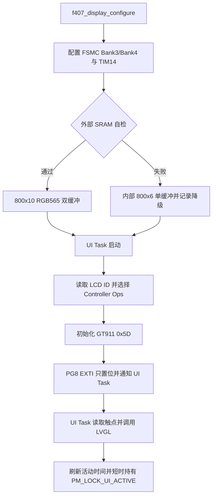

# LCD、GT911、LVGL 与 CLI 板端验收

## 当前验证等级

| 链路 | 当前状态 | 已有证据 |
|---|---|---|
| ILI9806G/NT35510 HAL-free 驱动与 ID 分派 | Host Verified | Mock 覆盖两个 ID、未知 ID、初始化、窗口、像素数量、休眠和恢复；NT35510 扩展寄存器按 `0xF000/0xF001/...` 逐索引发送 |
| GT911 HAL-free 驱动 | Host Verified | Mock 覆盖 `0x5D` 地址选择、产品 ID、按下/释放、坐标变换、状态清除和 I2C 故障 |
| LVGL 双缓冲/回退与 UI 电源状态 | Host Verified | Mock 覆盖双缓冲、内部单缓冲降级、80%/20% 背光、Suspend/Resume 和输入活动 |
| F407 FSMC、SRAM、PWM、软件 I2C 与 EXTI 接线 | ARM Build Verified | App A/B 链接真实端口，构建门禁检查地址、Bank、关键引脚、IRQ 和通知符号 |
| 控制器 ID、FSMC 时序、背光极性、触摸方向和功耗 | Board Unverified | 尚未连接屏幕并采集真实波形和电流数据 |
| USART1 CLI 软件链 | Host Verified + ARM Build Verified | Parser/Transport Mock、PA9/PA10、DMA2 Stream2/7、IDLE 与 Notification 门禁 |

## 已选硬件与资源映射

屏幕固定为野火 4.3 寸 `800x480`、16 位 MCU 电容屏。LCD 批次允许为 ILI9806G 或 NT35510，触摸控制器必须为 GT911。代码不猜测 LCD 型号：读取 `0xD3` 后只接受 `0x9806` 或 `0x5510`，其他结果返回 `ERR_UNSUPPORTED`。

NT35510 初始化中的厂商扩展寄存器使用 16 位索引地址逐项写入，不把 `0xF0` 后的多个字节当作普通连续参数。该格式与[野火 STM32F407 LCD 示例](https://doc.embedfire.com/mcu/stm32/f407batianhu/std/zh/latest/book/LCD.html)中的 `0xF000` 至 `0xF004` 写法一致；完整上电参数仍需按实际屏幕批次上板确认。

| 功能 | STM32F407 资源 | 说明 |
|---|---|---|
| LCD 总线 | FSMC Bank3 / NE3 PG10 | 16 位 8080，同步 CPU Flush |
| LCD A0 | PF0 | 命令地址 `0x68000000`，数据地址 `0x68000002` |
| LCD Reset | PF11 | 低有效 |
| LCD Backlight | PF9 / TIM14_CH1 | 低有效 PWM，Active 80%，Eco 20% |
| 外部 SRAM | FSMC Bank4 / NE4 PG12 | IS62WV51216，基址 `0x6C000000`，容量 1 MB |
| GT911 SCL/SDA | PD7 / PD3 | GPIO 模拟 I2C，不占用硬件 I2C 或 SPI |
| GT911 RST/INT | PD6 / PG8 | PG8 falling-edge EXTI，NVIC 优先级 6 |
| MAX31865 SPI2 | PB13/PB14/PB15 | 不再重映射到 PD3/PC2/PC3 |

## 运行链

`f407_gt911_port.c` 的 ISR 不执行 I2C 或坐标解析，只调用 `xTaskNotifyFromISR()`。UI Task 最长每 10 ms 周期运行一次，触摸中断可提前唤醒；触摸活动把 Power Manager 活动时间刷新，并将 `PM_LOCK_UI_ACTIVE` 保持 3 秒。LCD Flush 当前为保守同步 FSMC 循环写，真实带宽测量前不引入 DMA。

## CubeIDE 图形化同步清单

当前实现位于手写 BSP，不修改 CubeMX 生成文件。后续在 CubeIDE 图形界面同步时按以下清单配置，并先提交或备份 `.ioc`：

1. 启用 FSMC/NOR-SRAM Bank3：NE3、16-bit、异步 SRAM/NOR 模式、允许写，A0 用于 LCD RS。
2. 启用 FSMC/NOR-SRAM Bank4：NE4、16-bit、异步 SRAM、允许写，并配置 A0-A18、NBL0/NBL1。
3. 保留共享 D0-D15、NOE 和 NWE；确认 Bank3 使用 PG10，Bank4 使用 PG12。
4. PF11 配置为推挽输出，默认拉低复位；PF9 配置为 TIM14_CH1 AF9。
5. PD7/PD3 配置为开漏输出并上拉，PD6 为推挽输出，PG8 为下降沿 EXTI 输入并上拉。
6. EXTI9_5 中断抢占优先级设为 6，不得高于 FreeRTOS `configLIBRARY_MAX_SYSCALL_INTERRUPT_PRIORITY=5` 的允许范围。
7. SPI2 保持 PB13/PB14/PB15 和 PA4 CS，不添加 PD3/PC2/PC3 运行时重映射。
8. 重新生成后比较 `gpio.c`、`stm32f4xx_hal_msp.c` 和中断文件，避免重复定义 `EXTI9_5_IRQHandler`；如 CubeMX 接管 IRQ，应只从生成 Handler 转调手写端口 ISR。

## LCD 与触摸上板顺序

1. 首先关闭背光，用调试器读取 LCD `0xD3`，确认得到 `0x9806` 或 `0x5510`；未知 ID 必须停止初始化并保留原始读值。
2. 以低速保守时序显示红、绿、蓝、白、黑和 RGB565 色条，确认字节序、窗口边界与扫描方向。
3. 用逻辑分析仪测量 NE3、A0、NWE、NOE 和数据线，依据屏幕批次数据手册逐步收紧 FSMC 时序。
4. 读取 GT911 产品 ID 和 `0x8048` 分辨率，只观察厂商配置，不写入未知配置表。
5. 触摸四角和中心，核对 X/Y 交换、镜像、按下/释放、越界过滤和中断电平；需要调整时只改软件坐标变换参数。
6. 对 SRAM 执行地址线/数据线测试，确认自检通过使用两块 16,000 B 缓冲；拔除或故障注入后应退回 9,600 B 内部缓冲。
7. 压测六页切换、采集任务、Modbus/CAN、W25Q128 和 OTA 并发，记录 UI 刷新时间、任务栈余量和采集抖动。
8. 测量 Active 80%、Eco 20%、Suspend 和 Resume 的背光波形、电流、LCD/GT911 唤醒时间。

## CLI 与配置验收

使用 115200-8-N-1 连接 USART1 PA9/PA10。连续发送短命令、边界命令和错误命令，确认 Circular DMA wrap 后不丢行、不重复解析。重点执行 `status`、`rtos`、`power status`、`config show`、`ui page` 和 `ota status`。

配置修改仍由 Storage Task 在 Config Mutex 下完成持久化与提交。本阶段没有修改 OTA 包格式、Bootloader 接口、工业采集协议或网络接口。

只有保存 LCD/触摸 ID、逻辑分析仪截图、SRAM压力结果、功耗数据和演示视频后，才能把相应项目标记为 Board Verified。

## 资料依据

- [野火 4.3/4.5 寸 MCU 屏幕资料](https://doc.embedfire.com/products/link/zh/latest/module/screen/ebf_lcd_mcu_4.5_4.3.html)
- [野火 STM32F407 霸天虎 LCD/FSMC 示例](https://doc.embedfire.com/mcu/stm32/f407batianhu/std/zh/latest/book/LCD.html)
- [Goodix GT911 产品页](https://www.goodix.com/en/product/touch/touch_screen_controller)
- [ST STM32F407 参考手册 RM0090](https://www.st.com/resource/en/reference_manual/dm00031020-stm32f405-415-stm32f407-417-stm32f427-437-and-stm32f429-439-advanced-armbased-32bit-mcus-stmicroelectronics.pdf)
